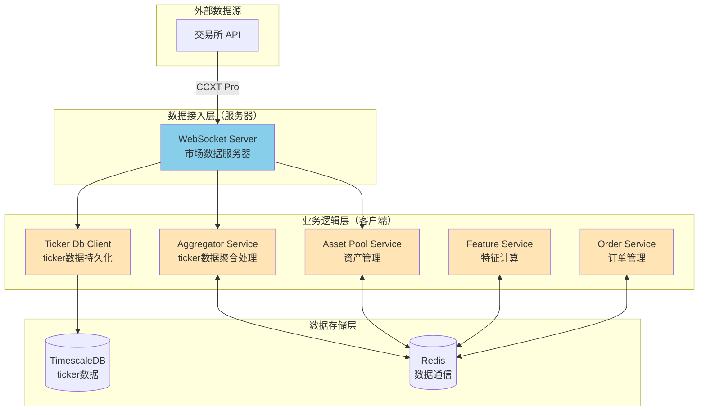
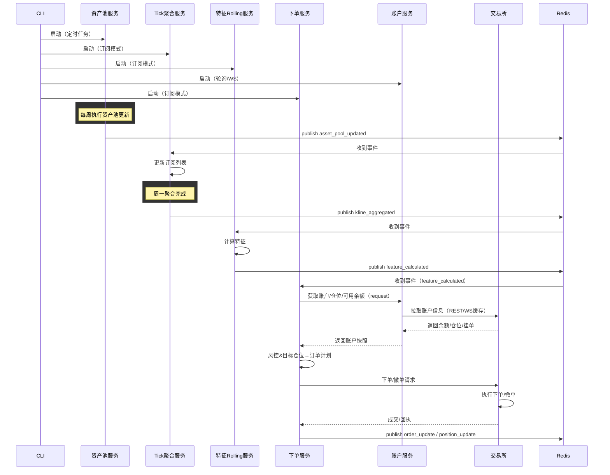

# 架构设计

本章节详细介绍 Quant Trading 系统的架构设计和技术实现。

## 系统架构

```mermaid
graph TB
    subgraph "外部数据源"
        Exchange[交易所 API]
    end
    
    subgraph "数据接入层（服务器）"
        Server[WebSocket Server<br/>市场数据服务器]
    end
    
    subgraph "业务逻辑层（客户端）"
        AggClient[Aggregator Service<br/>ticker数据聚合处理]
        PoolClient[Asset Pool Service<br/>资产管理]
        DBClient[Ticker Db Client<br/>ticker数据持久化]
        Feature[Feature Service<br/>特征计算]
        Order[Order Service<br/>订单管理]
    end
    
    subgraph "数据存储层"
        TimescaleDB[(TimescaleDB<br/>ticker数据)]
        Redis[(Redis<br/>数据通信)]
    end
    
    Exchange -->|CCXT Pro| Server
    Server --> AggClient
    Server --> PoolClient
    Server --> DBClient
    
    DBClient --> TimescaleDB
    
    AggClient <--> Redis
    PoolClient <--> Redis
    Feature <--> Redis
    Order <--> Redis
    
    style DBClient fill:#FFE4B5
    style Server fill:#87CEEB
    style AggClient fill:#FFE4B5
    style PoolClient fill:#FFE4B5
    style Feature fill:#FFE4B5
    style Order fill:#FFE4B5
```

## 数据流图

```mermaid
sequenceDiagram
    participant CLI
    participant 资产池服务
    participant Tick聚合服务
    participant 特征Rolling服务
    participant 下单服务
    participant 账户服务
    participant 交易所
    participant Redis

    CLI->>资产池服务: 启动（定时任务）
    CLI->>Tick聚合服务: 启动（订阅模式）
    CLI->>特征Rolling服务: 启动（订阅模式）
    CLI->>账户服务: 启动（轮询/WS）
    CLI->>下单服务: 启动（订阅模式）

    rect
        Note over 资产池服务: 每周执行资产池更新
    end

    资产池服务->>Redis: publish asset_pool_updated
    Redis->>Tick聚合服务: 收到事件
    Tick聚合服务->>Tick聚合服务: 更新订阅列表

    rect
        Note over Tick聚合服务: 周一聚合完成
    end

    Tick聚合服务->>Redis: publish kline_aggregated
    Redis->>特征Rolling服务: 收到事件
    特征Rolling服务->>特征Rolling服务: 计算特征
    特征Rolling服务->>Redis: publish feature_calculated
    Redis->>下单服务: 收到事件（feature_calculated）
    下单服务->>账户服务: 获取账户/仓位/可用余额（request）
    账户服务->>交易所: 拉取账户信息（REST/WS缓存）
    交易所-->>账户服务: 返回余额/仓位/挂单
    账户服务-->>下单服务: 返回账户快照
    下单服务->>下单服务: 风控&目标仓位→订单计划
    下单服务->>交易所: 下单/撤单请求
    交易所->>交易所: 执行下单/撤单
    交易所-->>下单服务: 成交/回执
    下单服务->>Redis: publish order_update / position_update
```
