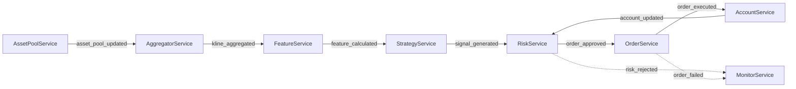
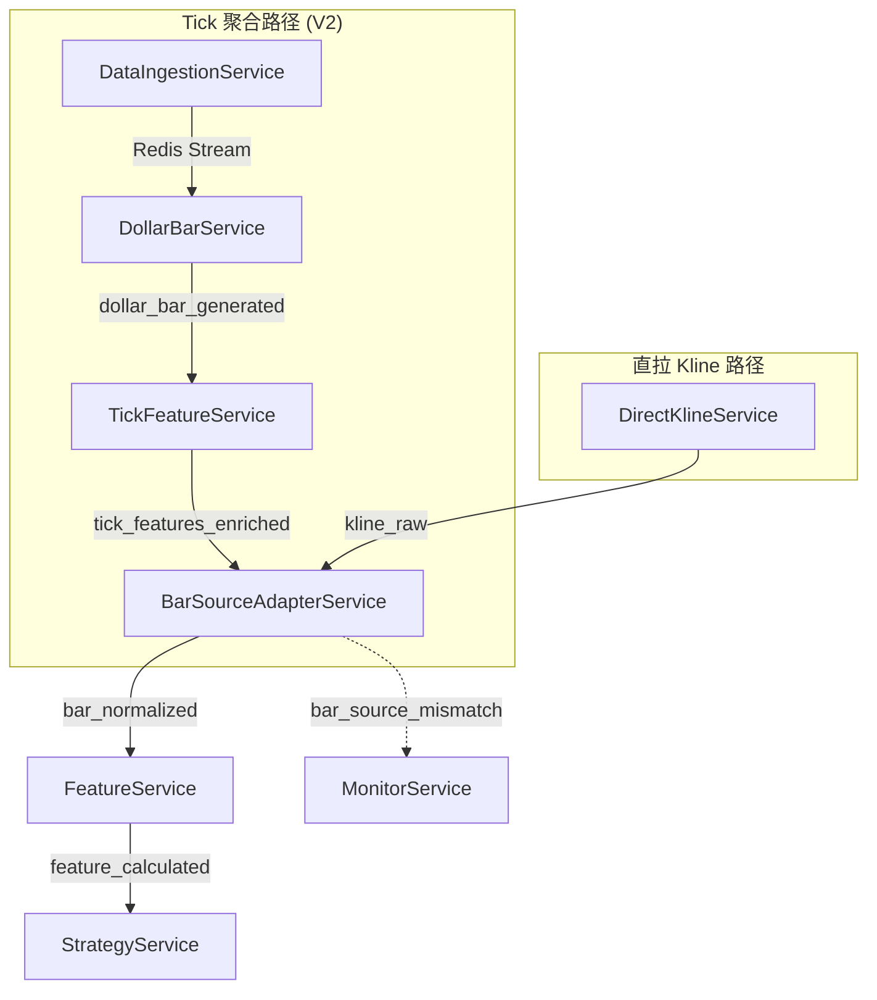

# Redis 事件总线（内部通信）参考

本页定义服务间内部通信契约，作为 HTTP / WebSocket 外部 API 的补充。

- **面向后端服务之间通信**（Strategy / Risk / Order / Account / Monitor / Feature）。
- **不面向浏览器前端直连**。前端对接仍以 [HTTP API](http.md) / [WebSocket API](websocket.md) 为准。

版本说明：

| 版本 | 覆盖策略 | 数据链路 |
|------|---------|---------|
| **V1 (MVP)** | strategy_2 (baseline_rev) | AssetPool → DirectKline → Feature → Strategy → Risk → Order → Account |
| **V2** | + strategy_1 (Top 10 多因子) + strategy_3 (ofi_14d) | 新增 DataIngestion → DollarBar → TickFeature → BarSourceAdapterService；多策略并行 |

---

## 一、通信分层

### 1) Redis Pub/Sub（低频业务事件）

- 典型场景：`signal_generated`、`order_approved`、`risk_rejected`。
- 语义：`at-most-once`（订阅者不在线时可能丢消息）。
- 用法：实时触发主流程。

### 2) Redis Streams（高频数据流） [V2]

- 典型场景：`aggTrades` 高频数据。
- 语义：`at-least-once`（消费者组 + ACK）。
- 用法：高吞吐数据管线与短期回放。

---

## 二、统一消息外壳

所有 Pub/Sub 消息采用统一 JSON 外壳：

```json
{
  "event_type": "signal_generated",
  "source_service": "strategy_service",
  "timestamp": "2026-03-02T23:59:00Z",
  "trace_id": "trc-20260302-0001",
  "data": { }
}
```

| 字段 | 类型 | 必填 | 说明 |
|------|------|------|------|
| `event_type` | string | 是 | 事件类型，与通道语义一致 |
| `source_service` | string | 是 | 事件生产者服务名 |
| `timestamp` | string (ISO 8601) | 是 | 事件产生时间 (UTC) |
| `trace_id` | string | 推荐 | 跨服务追踪 ID，格式 `trc-{YYYYMMDD}-{seq}` |
| `data` | object | 是 | 事件业务载荷（各事件 Schema 见下文） |

---

## 三、V1 Pub/Sub 通道契约

V1 共 9 个通道，覆盖 strategy_2 (baseline_rev) 的完整交易闭环。

### 3.1 通道总览



| 通道 | 发布者 | 订阅者 | 频率 |
|------|--------|--------|------|
| `quant:asset_pool_updated` | AssetPoolService | AggregatorService | 每 24h |
| `quant:kline_aggregated` | AggregatorService | FeatureService | 每根 K 线 |
| `quant:feature_calculated` | FeatureService | StrategyService | 每次特征更新 |
| `quant:signal_generated` | StrategyService | RiskService | 每次换仓（R1: 每日 23:59 UTC） |
| `quant:order_approved` | RiskService | OrderService | 风控通过时 |
| `quant:risk_rejected` | RiskService | MonitorService | 风控拒绝时 |
| `quant:order_executed` | OrderService | AccountService, MonitorService | 每笔订单执行后 |
| `quant:order_failed` | OrderService | MonitorService | 订单失败时 |
| `quant:account_updated` | AccountService | RiskService | 每 30s 轮询后 |

---

### 3.2 `quant:asset_pool_updated`

资产池更新完成，下游服务刷新 symbol 列表。

**触发条件**: AssetPoolService 定时筛选完成（default 池每 24h）。

**`data` 载荷**:

```json
{
  "exchange": "binance",
  "pool_name": "default",
  "symbols": ["BTC/USDT:USDT", "ETH/USDT:USDT", "SOL/USDT:USDT"],
  "pool_size": 100,
  "metric": "usdt_volume_30d",
  "top_k": 100,
  "updated_at": "2026-03-02T00:00:00Z"
}
```

| 字段 | 类型 | 必填 | 说明 |
|------|------|------|------|
| `exchange` | string | 是 | 交易所标识 |
| `pool_name` | string | 是 | 池名称。V1 固定 `"default"` |
| `symbols` | string[] | 是 | 入选标的列表 (CCXT 统一格式) |
| `pool_size` | int | 是 | 入选数量 |
| `metric` | string | 是 | 筛选指标名 |
| `top_k` | int | 是 | 目标 Top-K |
| `updated_at` | string (ISO 8601) | 是 | 池更新完成时间 |

---

### 3.3 `quant:kline_aggregated`

K 线数据已聚合，可进行特征计算。

**触发条件**: AggregatorService (DirectKline) 拉取新 K 线后。

**`data` 载荷**:

```json
{
  "symbol": "BTC/USDT:USDT",
  "timeframe": "1m",
  "kline": {
    "timestamp": "2026-03-02T23:58:00Z",
    "open": 62400.00,
    "high": 62500.00,
    "low": 62380.00,
    "close": 62450.00,
    "volume": 12.345
  },
  "source": "direct_kline"
}
```

| 字段 | 类型 | 必填 | 说明 |
|------|------|------|------|
| `symbol` | string | 是 | 交易对 |
| `timeframe` | string | 是 | K 线周期，如 `"1m"`, `"5m"`, `"1h"` |
| `kline.timestamp` | string (ISO 8601) | 是 | K 线开始时间 |
| `kline.open` | float | 是 | 开盘价 |
| `kline.high` | float | 是 | 最高价 |
| `kline.low` | float | 是 | 最低价 |
| `kline.close` | float | 是 | 收盘价 |
| `kline.volume` | float | 是 | 成交量 |
| `source` | string | 是 | 数据来源。V1 固定 `"direct_kline"` |

---

### 3.4 `quant:feature_calculated`

特征计算完成，策略服务可消费。

**触发条件**: FeatureService 完成一轮特征计算。

**`data` 载荷 (V1)**:

```json
{
  "calculation_id": "fc-20260302-235900",
  "calculation_time": "2026-03-02T23:59:00Z",
  "pool_name": "default",
  "features_version": "v1",
  "symbols_count": 98,
  "features": {
    "BTC/USDT:USDT": {
      "zscore_neg_ret_2h": 1.85,
      "zscore_neg_ret_4h": 1.42,
      "ret_2h": -0.0032,
      "ret_4h": -0.0058
    },
    "ETH/USDT:USDT": {
      "zscore_neg_ret_2h": -2.10,
      "zscore_neg_ret_4h": -1.88,
      "ret_2h": 0.0045,
      "ret_4h": 0.0072
    }
  },
  "missing_symbols": ["NEWTOKEN/USDT:USDT"]
}
```

| 字段 | 类型 | 必填 | 说明 |
|------|------|------|------|
| `calculation_id` | string | 是 | 本轮计算唯一 ID |
| `calculation_time` | string (ISO 8601) | 是 | 计算完成时间 |
| `pool_name` | string | 是 | 目标资产池 |
| `features_version` | string | 是 | 特征版本标识。V1 = `"v1"` |
| `symbols_count` | int | 是 | 成功计算特征的 symbol 数 |
| `features` | object | 是 | symbol → 特征映射 (见下表) |
| `missing_symbols` | string[] | 是 | 因数据不足未能计算的 symbol |

**V1 特征字段 (strategy_2 baseline_rev 所需)**:

| 特征名 | 类型 | 说明 |
|--------|------|------|
| `zscore_neg_ret_2h` | float \| null | 2h 收益的负向 z-score (window=30, negate=True)。跌 → 正值 → 做多 |
| `zscore_neg_ret_4h` | float \| null | 4h 收益的负向 z-score (window=30, negate=True) |
| `ret_2h` | float \| null | 原始 2h 收益率: `close(EOD) / close(EOD-2h) - 1` |
| `ret_4h` | float \| null | 原始 4h 收益率: `close(EOD) / close(EOD-4h) - 1` |

---

### 3.5 `quant:signal_generated`

策略信号生成完毕，目标仓位提交风控审核。

**触发条件**: StrategyService 在换仓时点（baseline_rev: 每日 23:59 UTC）调用 `generate_signal()` 后。

**`data` 载荷**:

```json
{
  "strategy_name": "baseline_rev",
  "signal_timestamp": "2026-03-02T23:59:00Z",
  "rebalance_id": "rb-20260302-001",
  "mode": "single",
  "pool_name": "default",
  "positions": [
    {
      "symbol": "BTC/USDT:USDT",
      "side": "long",
      "weight": 0.0167,
      "signal_value": 1.85,
      "reason": "baseline_rev_long"
    },
    {
      "symbol": "DOGE/USDT:USDT",
      "side": "short",
      "weight": -0.0167,
      "signal_value": -2.10,
      "reason": "baseline_rev_short"
    }
  ],
  "metadata": {
    "n_candidates": 480,
    "long_count": 30,
    "short_count": 30,
    "weight_per_symbol": 0.0167,
    "skipped": false
  }
}
```

| 字段 | 类型 | 必填 | 说明 |
|------|------|------|------|
| `strategy_name` | string | 是 | 策略标识 |
| `signal_timestamp` | string (ISO 8601) | 是 | 信号计算时间点 |
| `rebalance_id` | string | 是 | 本次换仓唯一 ID |
| `mode` | string | 是 | 策略模式。V1 固定 `"single"` |
| `pool_name` | string | 是 | 使用的资产池 |
| `positions` | TargetPosition[] | 是 | 目标仓位列表 |
| `metadata` | object | 是 | 调试信息 |

**TargetPosition 结构**:

| 字段 | 类型 | 必填 | 说明 |
|------|------|------|------|
| `symbol` | string | 是 | 交易对 |
| `side` | string | 是 | `"long"` \| `"short"` |
| `weight` | float | 是 | 占总资金比例。正值做多，负值做空 |
| `signal_value` | float | 是 | 原始信号值 |
| `reason` | string | 是 | 可读说明 |

---

### 3.6 `quant:order_approved`

风控通过，允许执行下单。

**触发条件**: RiskService 对 `signal_generated` 的所有规则检查全部通过。

**`data` 载荷**:

```json
{
  "rebalance_id": "rb-20260302-001",
  "strategy_name": "baseline_rev",
  "approved_at": "2026-03-02T23:59:01Z",
  "risk_check_summary": {
    "rules_checked": 5,
    "rules_passed": 5,
    "max_position_pct": { "threshold": 0.15, "actual": 0.0167, "passed": true },
    "max_total_exposure": { "threshold": 1.0, "actual": 1.0, "passed": true },
    "max_drawdown_halt": { "threshold": 0.30, "actual": 0.053, "passed": true },
    "min_balance_reserve": { "threshold": 100.0, "actual": 5120.30, "passed": true },
    "max_daily_turnover": { "threshold": 3.0, "actual": 0.45, "passed": true }
  },
  "target_portfolio": {
    "strategy_name": "baseline_rev",
    "positions": [
      {
        "symbol": "BTC/USDT:USDT",
        "side": "long",
        "weight": 0.0167,
        "signal_value": 1.85,
        "reason": "baseline_rev_long"
      }
    ],
    "long_count": 30,
    "short_count": 30
  }
}
```

| 字段 | 类型 | 必填 | 说明 |
|------|------|------|------|
| `rebalance_id` | string | 是 | 换仓 ID (来自 signal_generated) |
| `strategy_name` | string | 是 | 策略名 |
| `approved_at` | string (ISO 8601) | 是 | 批准时间 |
| `risk_check_summary` | object | 是 | 风控检查摘要 |
| `risk_check_summary.rules_checked` | int | 是 | 检查规则总数 |
| `risk_check_summary.rules_passed` | int | 是 | 通过规则数 |
| `risk_check_summary.{rule_name}` | object | 是 | 每条规则的 threshold / actual / passed |
| `target_portfolio` | object | 是 | 批准的目标仓位 (结构同 signal_generated) |

---

### 3.7 `quant:risk_rejected`

风控拒绝，不允许下单。

**触发条件**: RiskService 检查到至少一条规则未通过。

**`data` 载荷**:

```json
{
  "rebalance_id": "rb-20260302-001",
  "strategy_name": "baseline_rev",
  "rejected_at": "2026-03-02T23:59:01Z",
  "severity": "critical",
  "violated_rules": [
    {
      "rule_name": "max_drawdown_halt",
      "display_name": "最大回撤止损",
      "threshold": 0.30,
      "actual": 0.32,
      "message": "当前回撤 32% 超过阈值 30%, 触发暂停交易"
    }
  ],
  "action_taken": "halt_trading",
  "original_signal": {
    "strategy_name": "baseline_rev",
    "long_count": 30,
    "short_count": 30
  }
}
```

| 字段 | 类型 | 必填 | 说明 |
|------|------|------|------|
| `rebalance_id` | string | 是 | 换仓 ID |
| `strategy_name` | string | 是 | 策略名 |
| `rejected_at` | string (ISO 8601) | 是 | 拒绝时间 |
| `severity` | string | 是 | `"warning"` \| `"critical"` |
| `violated_rules` | object[] | 是 | 违反的规则列表 |
| `violated_rules[].rule_name` | string | 是 | 规则标识 |
| `violated_rules[].display_name` | string | 是 | 规则显示名 |
| `violated_rules[].threshold` | float | 是 | 阈值 |
| `violated_rules[].actual` | float | 是 | 实际值 |
| `violated_rules[].message` | string | 是 | 可读描述 |
| `action_taken` | string | 是 | 采取的动作: `"halt_trading"` \| `"skip_rebalance"` |
| `original_signal` | object | 是 | 被拒绝的信号摘要 |

---

### 3.8 `quant:order_executed`

订单执行成功（含 dry-run 模式）。

**触发条件**: OrderService 完成一笔订单执行后。

**`data` 载荷**:

```json
{
  "rebalance_id": "rb-20260302-001",
  "order_id": "ord-20260302-001",
  "symbol": "BTC/USDT:USDT",
  "side": "buy",
  "type": "market",
  "amount": 0.005,
  "filled_amount": 0.005,
  "avg_fill_price": 62450.00,
  "cost": 312.25,
  "fee": 0.125,
  "fee_currency": "USDT",
  "strategy_name": "baseline_rev",
  "dry_run": true,
  "executed_at": "2026-03-02T23:59:05Z",
  "execution_time_ms": 450,
  "idempotency_key": "idem-rb20260302001-BTCUSDT-buy"
}
```

| 字段 | 类型 | 必填 | 说明 |
|------|------|------|------|
| `rebalance_id` | string | 是 | 换仓 ID |
| `order_id` | string | 是 | 订单唯一 ID |
| `symbol` | string | 是 | 交易对 |
| `side` | string | 是 | `"buy"` \| `"sell"` |
| `type` | string | 是 | 订单类型。V1 固定 `"market"` |
| `amount` | float | 是 | 下单数量 |
| `filled_amount` | float | 是 | 成交数量 |
| `avg_fill_price` | float | 是 | 平均成交价 |
| `cost` | float | 是 | 成交金额 (USDT) |
| `fee` | float | 是 | 手续费 |
| `fee_currency` | string | 是 | 手续费币种 |
| `strategy_name` | string | 是 | 策略名 |
| `dry_run` | bool | 是 | 是否为模拟执行 |
| `executed_at` | string (ISO 8601) | 是 | 执行完成时间 |
| `execution_time_ms` | int | 是 | 执行耗时 (毫秒) |
| `idempotency_key` | string | 是 | 幂等键，防止重复执行 |

---

### 3.9 `quant:order_failed`

订单执行失败。

**触发条件**: OrderService 重试 3 次后仍失败。

**`data` 载荷**:

```json
{
  "rebalance_id": "rb-20260302-001",
  "order_id": "ord-20260302-005",
  "symbol": "XRP/USDT:USDT",
  "side": "sell",
  "type": "market",
  "amount": 150.0,
  "strategy_name": "baseline_rev",
  "dry_run": false,
  "error_code": "InsufficientBalance",
  "error_message": "Account balance insufficient for this order",
  "retry_count": 3,
  "failed_at": "2026-03-02T23:59:08Z",
  "idempotency_key": "idem-rb20260302001-XRPUSDT-sell"
}
```

| 字段 | 类型 | 必填 | 说明 |
|------|------|------|------|
| `rebalance_id` | string | 是 | 换仓 ID |
| `order_id` | string | 是 | 订单 ID |
| `symbol` | string | 是 | 交易对 |
| `side` | string | 是 | `"buy"` \| `"sell"` |
| `type` | string | 是 | 订单类型 |
| `amount` | float | 是 | 预期下单数量 |
| `strategy_name` | string | 是 | 策略名 |
| `dry_run` | bool | 是 | 是否为模拟执行 |
| `error_code` | string | 是 | 交易所/系统错误码 |
| `error_message` | string | 是 | 错误描述 |
| `retry_count` | int | 是 | 已重试次数 |
| `failed_at` | string (ISO 8601) | 是 | 最终失败时间 |
| `idempotency_key` | string | 是 | 幂等键 |

---

### 3.10 `quant:account_updated`

账户状态同步完成。

**触发条件**: AccountService 定时轮询交易所 API (每 30s) 后。

**`data` 载荷**:

```json
{
  "exchange": "binance",
  "balance": {
    "total_equity": 10234.56,
    "available_balance": 5120.30,
    "used_margin": 5114.26,
    "unrealized_pnl": 123.45,
    "currency": "USDT"
  },
  "positions_count": 45,
  "long_count": 30,
  "short_count": 15,
  "open_orders_count": 3,
  "synced_at": "2026-03-02T23:58:30Z"
}
```

| 字段 | 类型 | 必填 | 说明 |
|------|------|------|------|
| `exchange` | string | 是 | 交易所标识 |
| `balance.total_equity` | float | 是 | 总权益 (USDT) |
| `balance.available_balance` | float | 是 | 可用余额 |
| `balance.used_margin` | float | 是 | 已用保证金 |
| `balance.unrealized_pnl` | float | 是 | 未实现盈亏 |
| `balance.currency` | string | 是 | 计价币种 |
| `positions_count` | int | 是 | 当前持仓总数 |
| `long_count` | int | 是 | 多头数量 |
| `short_count` | int | 是 | 空头数量 |
| `open_orders_count` | int | 是 | 活跃挂单数 |
| `synced_at` | string (ISO 8601) | 是 | 同步完成时间 |

---

## 四、V1 Redis 键

V1 所需的全部 Redis 键:

| 键模式 | 类型 | 用途 | 写入者 |
|--------|------|------|--------|
| `quant:asset_pool:{exchange}` | Set | 默认资产池 (Top-100 symbols) | AssetPoolService |
| `quant:kline:{symbol}:{timeframe}` | String (JSON) | 最新 K 线快照 | AggregatorService |
| `quant:features:latest:{symbol}` | String (JSON) | 最新特征快照 | FeatureService |
| `quant:signal:latest` | String (JSON) | 最新策略目标仓位 | StrategyService |
| `quant:account:balance` | String (JSON) | 账户余额快照 | AccountService |
| `quant:account:positions` | String (JSON) | 当前持仓快照 | AccountService |
| `quant:account:orders` | String (JSON) | 活跃挂单快照 | AccountService |
| `quant:portfolio:snapshot` | String (JSON) | NAV / PnL / 回撤等组合指标 | AccountService |
| `quant:heartbeat:{service}` | String (JSON + TTL 120s) | 服务心跳 | 各服务 |
| `quant:state:{service}:last_run` | String | 上次执行时间戳 | 各服务 |
| `quant:state:{service}:status` | String | 运行状态 (`running` \| `idle` \| `error`) | 各服务 |
| `quant:risk:status` | String (JSON) | 风控状态快照 | RiskService |
| `quant:risk:disabled_symbols` | Set | 被停用的交易对 | RiskService |
| `quant:system:emergency_stop` | String (JSON) | 紧急停机状态 | API Gateway |

### 键值示例

**`quant:features:latest:{symbol}`**:

```json
{
  "symbol": "BTC/USDT:USDT",
  "timestamp": "2026-03-02T23:59:00Z",
  "features": {
    "zscore_neg_ret_2h": 1.85,
    "zscore_neg_ret_4h": 1.42,
    "ret_2h": -0.0032,
    "ret_4h": -0.0058
  }
}
```

**`quant:signal:latest`**:

```json
{
  "strategy_name": "baseline_rev",
  "mode": "single",
  "signal_timestamp": "2026-03-02T23:59:00Z",
  "rebalance_id": "rb-20260302-001",
  "positions": [
    { "symbol": "BTC/USDT:USDT", "side": "long", "weight": 0.0167, "signal_value": 1.85 },
    { "symbol": "DOGE/USDT:USDT", "side": "short", "weight": -0.0167, "signal_value": -2.10 }
  ],
  "long_count": 30,
  "short_count": 30
}
```

**`quant:portfolio:snapshot`**:

```json
{
  "nav": 10234.56,
  "initial_nav": 10000.00,
  "total_return": 0.023456,
  "daily_pnl": -12.50,
  "daily_pnl_pct": -0.0012,
  "drawdown": -0.053,
  "max_drawdown": -0.082,
  "sharpe_30d": 1.85,
  "volatility_30d": 0.185,
  "updated_at": "2026-03-02T23:59:00Z"
}
```

**`quant:heartbeat:{service}`** (TTL 120s):

```json
{
  "service": "strategy_service",
  "status": "healthy",
  "timestamp": "2026-03-02T23:58:30Z",
  "uptime_seconds": 86400,
  "metrics": {
    "last_signal_time": "2026-03-02T23:55:00Z",
    "active_strategy": "baseline_rev"
  }
}
```

---

## 五、V2 新增 Pub/Sub 通道 [V2]

V2 在 V1 的 9 个通道基础上新增 5 个通道，支持双源数据管线和 tick 特征链路。

### 5.1 V2 通道总览



| 新增通道 | 发布者 | 订阅者 | 频率 |
|---------|--------|--------|------|
| `quant:dollar_bar_generated` | DollarBarService | TickFeatureService | 每根 Dollar Bar |
| `quant:tick_features_enriched` | TickFeatureService | BarSourceAdapterService | 每根 Dollar Bar |
| `quant:kline_raw` | DirectKlineService | BarSourceAdapterService | 每根 K 线 |
| `quant:bar_normalized` | BarSourceAdapterService | FeatureService | 归一化后 |
| `quant:bar_source_mismatch` | BarSourceAdapterService | MonitorService | 偏差超阈值时 |

---

### 5.2 `quant:dollar_bar_generated` [V2]

Dollar Bar 聚合完成，输出 23 列结构。

**触发条件**: DollarBarService 累计 dollar_volume 达到自适应阈值 (\(\theta\)) 后切分。

**`data` 载荷**:

```json
{
  "symbol": "BTC/USDT:USDT",
  "bar_id": "db-BTC-20260302-145230",
  "threshold": 500000.0,
  "bar": {
    "timestamp": "2026-03-02T14:52:30Z",
    "open": 62400.00,
    "high": 62520.00,
    "low": 62380.00,
    "close": 62480.00,
    "volume": 8.025,
    "buy_volume": 4.512,
    "sell_volume": 3.513,
    "dollar_volume": 501250.00,
    "buy_sell_imbalance": 0.1244,
    "vwap": 62461.06,
    "tick_count": 342,
    "duration_seconds": 45.2,
    "open_interest_delta": 0.5,
    "high_low_range": 140.00,
    "body_range": 80.00,
    "upper_shadow": 40.00,
    "lower_shadow": 20.00,
    "trades_per_second": 7.57,
    "avg_trade_size": 0.0235,
    "max_trade_size": 0.250,
    "price_impact": 0.00032,
    "aggressor_ratio": 0.562,
    "kyle_lambda_raw": 0.0015
  }
}
```

**核心字段 (strategy_3 ofi_14d 依赖)**:

| 字段 | 类型 | 说明 |
|------|------|------|
| `bar.buy_sell_imbalance` | float | \(\frac{buy\_volume - sell\_volume}{volume}\)，日级聚合为 `ofi_d` |
| `bar.dollar_volume` | float | \(\sum p_i q_i\)，日级聚合为 `dollar_volume_d` |

**核心字段 (strategy_1 tick 特征依赖)**:

| 字段 | 类型 | 说明 |
|------|------|------|
| `bar.volume` | float | 总成交量 |
| `bar.buy_volume` | float | 主动买成交量 |
| `bar.sell_volume` | float | 主动卖成交量 |
| `bar.tick_count` | int | bar 内 tick 数 |
| `bar.aggressor_ratio` | float | 主动买比例 |
| `bar.kyle_lambda_raw` | float | Kyle's Lambda 原始值 |

---

### 5.3 `quant:tick_features_enriched` [V2]

Tick 微观特征计算完成（9 个特征），strategy_1 所需。

**触发条件**: TickFeatureService 对最新 Dollar Bar 的 rolling 50 bars 计算完成后。

**`data` 载荷**:

```json
{
  "symbol": "BTC/USDT:USDT",
  "bar_id": "db-BTC-20260302-145230",
  "features": {
    "tick_vpin": 0.342,
    "tick_toxicity_run_mean": 0.285,
    "tick_toxicity_run_max": 0.512,
    "tick_toxicity_run_ratio": 0.556,
    "tick_kyle_lambda": 0.0018,
    "tick_burstiness": 1.24,
    "tick_jump_ratio": 0.085,
    "tick_whale_imbalance": 0.123,
    "tick_whale_impact": 0.0045
  },
  "rolling_window": 50,
  "calculated_at": "2026-03-02T14:52:31Z"
}
```

| 特征名 | 类型 | 说明 |
|--------|------|------|
| `tick_vpin` | float | 成交量加权知情交易概率 (Volume-Synchronized PIN) |
| `tick_toxicity_run_mean` | float | 毒性流均值 |
| `tick_toxicity_run_max` | float | 毒性流最大值 |
| `tick_toxicity_run_ratio` | float | 毒性流比率 |
| `tick_kyle_lambda` | float | Kyle's Lambda (市场深度) |
| `tick_burstiness` | float | 交易聚集度 |
| `tick_jump_ratio` | float | 跳跃比率 |
| `tick_whale_imbalance` | float | 大单买卖不平衡 |
| `tick_whale_impact` | float | 大单价格冲击 |

---

### 5.4 `quant:kline_raw` [V2]

直拉 K 线数据（双源模式的 Kline 路径）。

**触发条件**: DirectKlineService 从交易所拉取新 K 线后。

**`data` 载荷**:

```json
{
  "symbol": "BTC/USDT:USDT",
  "timeframe": "1m",
  "kline": {
    "timestamp": "2026-03-02T23:58:00Z",
    "open": 62400.00,
    "high": 62500.00,
    "low": 62380.00,
    "close": 62450.00,
    "volume": 12.345
  },
  "source": "direct_kline",
  "exchange": "binance"
}
```

结构与 V1 `kline_aggregated` 一致，但作为 BarSourceAdapterService 的输入而非直接给 FeatureService。

---

### 5.5 `quant:bar_normalized` [V2]

统一 Bar 契约，屏蔽上游来源差异。下游 Feature/Strategy/Risk/Order 不感知数据来源。

**触发条件**: BarSourceAdapterService 归一化完成后。

**`data` 载荷**:

```json
{
  "symbol": "BTC/USDT:USDT",
  "timeframe": "adaptive",
  "source": "tick_agg",
  "bar": {
    "timestamp": "2026-03-02T14:52:30Z",
    "open": 62400.00,
    "high": 62520.00,
    "low": 62380.00,
    "close": 62480.00,
    "volume": 8.025,
    "dollar_volume": 501250.00,
    "buy_sell_imbalance": 0.1244
  },
  "tick_features": {
    "tick_vpin": 0.342,
    "tick_kyle_lambda": 0.0018,
    "tick_jump_ratio": 0.085
  },
  "normalized_at": "2026-03-02T14:52:31Z"
}
```

| 字段 | 类型 | 必填 | 说明 |
|------|------|------|------|
| `symbol` | string | 是 | 交易对 |
| `timeframe` | string | 是 | `"1m"` (direct_kline) 或 `"adaptive"` (dollar_bar) |
| `source` | string | 是 | `"tick_agg"` \| `"direct_kline"` \| `"hybrid"` |
| `bar` | object | 是 | 归一化后的 OHLCV + 扩展字段 |
| `bar.dollar_volume` | float | 否 | tick_agg 来源时可用；direct_kline 时为 null |
| `bar.buy_sell_imbalance` | float | 否 | tick_agg 来源时可用 |
| `tick_features` | object \| null | 否 | tick_agg 来源时携带 tick 特征；direct_kline 时为 null |
| `normalized_at` | string (ISO 8601) | 是 | 归一化完成时间 |

---

### 5.6 `quant:bar_source_mismatch` [V2]

双源对账偏差告警（仅 `hybrid` 模式触发）。

**触发条件**: BarSourceAdapterService 比较 tick_agg 与 direct_kline 的 OHLCV，偏差超过阈值。

**`data` 载荷**:

```json
{
  "symbol": "BTC/USDT:USDT",
  "mismatch_type": "close_price",
  "tick_agg_value": 62480.00,
  "direct_kline_value": 62510.00,
  "deviation_bps": 4.8,
  "threshold_bps": 5,
  "consecutive_mismatches": 3,
  "auto_fallback_triggered": false,
  "detected_at": "2026-03-02T14:53:00Z"
}
```

| 字段 | 类型 | 必填 | 说明 |
|------|------|------|------|
| `symbol` | string | 是 | 交易对 |
| `mismatch_type` | string | 是 | 偏差字段: `"open"` \| `"high"` \| `"low"` \| `"close_price"` \| `"volume"` |
| `tick_agg_value` | float | 是 | tick 聚合路径的值 |
| `direct_kline_value` | float | 是 | 直拉 kline 路径的值 |
| `deviation_bps` | float | 是 | 偏差 (基点) |
| `threshold_bps` | int | 是 | 配置的偏差阈值 |
| `consecutive_mismatches` | int | 是 | 连续偏差次数 |
| `auto_fallback_triggered` | bool | 是 | 是否已触发自动降级到 direct_kline |
| `detected_at` | string (ISO 8601) | 是 | 检测时间 |

---

## 六、V2 新增 Redis Streams [V2]

### `quant:stream:aggTrades:{symbol}`

高频逐笔成交数据流，DataIngestionService 写入，DollarBarService 消费。

| 属性 | 值 |
|------|-----|
| **类型** | Redis Stream |
| **MAXLEN** | ~100000 (近似裁剪) |
| **峰值吞吐** | ~120K msg/s (488 symbols × ~250 ticks/s) |
| **消费者组** | `dollar_bar_consumers` |
| **消费者命名** | `dollar_bar_{symbol}` |

**Stream Entry 结构**:

```json
{
  "symbol": "BTC/USDT:USDT",
  "timestamp": 1709423550123,
  "price": "62450.00",
  "quantity": "0.025",
  "is_buyer_maker": "false"
}
```

| 字段 | 类型 | 说明 |
|------|------|------|
| `symbol` | string | 交易对 |
| `timestamp` | int (ms) | 成交时间 (Unix 毫秒) |
| `price` | string | 成交价 (字符串避免精度丢失) |
| `quantity` | string | 成交量 |
| `is_buyer_maker` | string | `"true"` \| `"false"`，主动方方向标记 |

---

## 七、V2 新增 Redis 键 [V2]

| 键模式 | 类型 | 用途 | 写入者 |
|--------|------|------|--------|
| `quant:asset_pool:{exchange}:t50_monthly` | Set | T50 月度流动性池 (strategy_3) | AssetPoolService |
| `quant:features:daily:{symbol}` | String (JSON) | 日级聚合特征缓存 | FeatureService |
| `quant:features:rolling:{symbol}` | String (JSON) | 多日滚动特征缓存 | FeatureService |
| `quant:dollar_bar:{symbol}` | List | Dollar Bar 缓存 (最近 200 bars) | DollarBarService |
| `quant:kline:raw:{symbol}:{timeframe}` | String (JSON) | 直拉 kline 最新快照 | DirectKlineService |
| `quant:bar:normalized:{symbol}:{timeframe}` | String (JSON) | 统一 Bar 快照 | BarSourceAdapterService |
| `quant:stream:aggTrades:{symbol}` | Stream | 高频 tick 数据 | DataIngestionService |

### V2 键值示例

**`quant:features:daily:{symbol}`**:

```json
{
  "symbol": "BTC/USDT:USDT",
  "date": "2026-03-02",
  "close_d": 62480.00,
  "ret_d": -0.0012,
  "ofi_d": 0.0523,
  "dollar_volume_d": 12500000.00,
  "updated_at": "2026-03-02T23:59:00Z"
}
```

**`quant:features:rolling:{symbol}`**:

```json
{
  "symbol": "BTC/USDT:USDT",
  "date": "2026-03-02",
  "ofi_14d": 0.0345,
  "valid_days": 14,
  "updated_at": "2026-03-02T23:59:00Z"
}
```

**V2 `quant:features:latest:{symbol}` 扩展字段**:

V2 在 V1 特征基础上新增以下字段：

| 新增特征名 | 类型 | 说明 | 依赖策略 |
|-----------|------|------|---------|
| `tick_vpin_24h` | float \| null | EOD 前 24h bar 级 tick_vpin 的均值 | strategy_1 |
| `zscore_vpin` | float \| null | tick_vpin_24h 的 z-score (window=30, negate=False) | strategy_1 |
| `zscore_jump` | float \| null | tick_jump_ratio 的 z-score | strategy_1 |
| `volatility` | float \| null | 波动率指标 | strategy_1 (regime_switch) |
| `ofi_14d` | float \| null | 14 日滚动 OFI 均值 | strategy_3 |
| `zscore_ofi_14d` | float \| null | ofi_14d 的截面 z-score | strategy_3 |

**V2 `quant:signal:latest` 扩展**:

多策略模式下增加 `per_strategy` 字段：

```json
{
  "mode": "ensemble",
  "ensemble_method": "weighted_average",
  "signal_timestamp": "2026-03-02T23:59:00Z",
  "positions": [ ],
  "long_count": 20,
  "short_count": 20,
  "per_strategy": [
    {
      "strategy_name": "baseline_rev",
      "weight": 0.3,
      "pool_name": "default",
      "long_count": 30,
      "short_count": 30
    },
    {
      "strategy_name": "ofi_14d",
      "weight": 0.4,
      "pool_name": "t50_monthly",
      "long_count": 15,
      "short_count": 15
    }
  ]
}
```

---

## 八、V2 `feature_calculated` 载荷扩展 [V2]

V2 的 `feature_calculated` 事件增加 `features_version: "v2"` 标识，特征字段扩展：

```json
{
  "calculation_id": "fc-20260302-235900",
  "features_version": "v2",
  "features": {
    "BTC/USDT:USDT": {
      "zscore_neg_ret_2h": 1.85,
      "zscore_neg_ret_4h": 1.42,
      "ret_2h": -0.0032,
      "ret_4h": -0.0058,
      "tick_vpin_24h": 0.342,
      "zscore_vpin": 0.85,
      "zscore_jump": 1.12,
      "volatility": 0.0234,
      "ofi_14d": 0.0345,
      "zscore_ofi_14d": 1.56
    }
  }
}
```

StrategyService 根据策略配置的 `required_features` 选取所需子集。

---

## 九、可靠性与恢复约定

1. **主路径**采用 Pub/Sub 实时触发。
2. 服务必须实现**定时兜底任务**（防止 Pub/Sub 丢消息导致流程中断）。
3. 服务重启后需读取 `quant:state:{service}:*` 做**补执行判断**。
4. Order 相关消费侧必须实现**幂等**（通过 `idempotency_key` 防止重复执行下单）。
5. [V2] `hybrid` 模式建议并行消费 `tick_agg` 与 `direct_kline`，并基于 `bar_source_mismatch` 做**自动降级**。

---

## 十、与外部 API 的边界

- **对外查询与控制**: 使用 [HTTP API](http.md)。
- **对外实时推送**: 使用 [WebSocket API](websocket.md)。
- **服务内部事件流**: 使用本文档定义的 Redis 契约。
