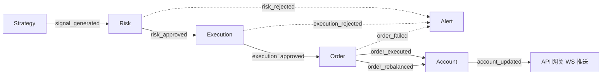

# Redis 事件总线（内部通信）

> 服务间内部通信契约。命名空间约定与模块职责以 [架构文档](../architecture/index.md) 为准；本文定义频道与键的载荷。
>
> **核心约定（账户作用域）**：每个策略一条竖直栈，绑一个账户。所有**业务**频道/键带账户前缀 `quant:{account}:<逻辑名>`；**公共行情**键全局共享。前缀由 Keyspace 模块统一注入，服务只说逻辑名。下文用 `{account}` 占位（如 `acctA`/`acctB`）。

## 一、通信分层

| 层 | 机制 | 语义 | 用途 |
|----|------|------|------|
| 低频业务事件 | Redis Pub/Sub | at-most-once（+ 定时兜底） | `signal_generated` / `risk_approved` / `execution_approved` … |
| 高频公共行情 | Redis Streams | at-least-once（消费者组 + ACK） | `market:trades`（策略 6 消费者组） |

## 二、统一消息外壳

所有 Pub/Sub 消息：

```json
{
  "event_type": "signal_generated",
  "source_service": "strategy_service",
  "account": "acctA",
  "timestamp": "2026-06-13T00:10:00Z",
  "trace_id": "trc-acctA-20260613-0001",
  "data": { }
}
```

| 字段 | 必填 | 说明 |
|------|------|------|
| `event_type` | 是 | 事件类型 |
| `source_service` | 是 | 生产者服务名 |
| `account` | 是 | 所属账户/栈标识（与频道前缀一致） |
| `timestamp` | 是 | ISO 8601 UTC |
| `trace_id` | 推荐 | 跨服务追踪 ID |
| `data` | 是 | 业务载荷（见下文） |

## 三、频道契约（单栈，频道名均 `quant:{account}:<名>`）


```mermaid
flowchart LR
    Strategy -->|signal_generated| Risk
    Risk -->|risk_approved| Execution
    Risk -.->|risk_rejected| Alert
    Execution -->|execution_approved| Order
    Execution -.->|execution_rejected| Alert
    Order -->|order_executed| Account
    Order -.->|order_failed| Alert
    Order -->|order_rebalanced| Account
    Account -->|account_updated| Gateway["API 网关 WS 推送"]
```

| 频道（去前缀） | 发布者 | 订阅者 |
|----------------|--------|--------|
| `signal_generated` | Strategy | Risk |
| `risk_approved` | Risk | Execution |
| `risk_rejected` | Risk | Alert |
| `execution_approved` | Execution | Order |
| `execution_rejected` | Execution | Alert |
| `order_executed` | Order | Account |
| `order_failed` | Order | Alert |
| `order_rebalanced` | Order | Account |
| `account_updated` | Account | API 网关 |

公共（全局，无账户前缀）：`asset_pool_updated`（AssetPool → 仅 Monitor；下游直接读 SET）。

### 3.1 `signal_generated`

策略产出 **Target Portfolio**（完整目标组合，永不增量）交 Risk 做 sizing。

**触发**：

- **scheduler 策略（策略 5）**：每日 `rebalance_hour_utc:rebalance_minute_utc` 触发一次，发布完整目标组合（含「仅止损检查日」也发全量）。
- **streaming 策略（策略 6）**：每根美元 bar 完成时发布完整目标组合（绝大多数 bar 与上次相同，下游差量折叠为 0 单）。

**载荷**（`TargetPortfolio.to_dict()`）：

```json
{
  "legs": [
    { "symbol": "BTC/USDT:USDT", "side": "long",  "target_weight": 0.8034, "signal_value": 0.8034, "reason": "majors_long" },
    { "symbol": "SOL/USDT:USDT", "side": "short", "target_weight": -0.1148, "signal_value": -0.1148, "reason": "alts_basket_short" }
  ],
  "strategy_name": "monthly_majors_vs_alts",
  "signal_timestamp": "2026-06-13T00:10:00Z",
  "signal_type": "target_weight",
  "rebalance_id": "rb-monthly_majors_vs_alts-20260613T0010",
  "metadata": { "leverage": 1.15, "realised_vol": 0.174, "is_rebalance_day": false, "basket_size": 100, "stopped": {} }
}
```

| 字段 | 说明 |
|------|------|
| `legs[]` | 完整目标组合（带符号 `target_weight`，**不含 USDT sizing**）。空仓批次 `legs: []` + metadata 带 `flat_reason` |
| `signal_type` | `target_weight`（两策略统一）。仅当 sizing 语义真不同才引入新类型 |
| `rebalance_id` | 确定性幂等键：scheduler = `rb-{strategy}-{计划触发时刻}`；streaming = `rb-{strategy}-{bar收盘时间戳}`。重试同 id |
| `metadata` | 策略私有、原样透传（策略 5：`leverage`/`stopped`…；策略 6：`gate`/`cb_active`…） |

同时覆盖写 `quant:{account}:signal:latest`。

### 3.2 `risk_approved` / `risk_rejected`

Risk 按账户权益 sizing：`notional_usdt = |target_weight| × equity`，equity 读 `quant:{account}:account:balance` 的 `total_equity`（缺失/超 `balance_max_age_seconds` 回退 `default_equity_usdt`）；低于 `min_notional_usdt` 剔腿；总名义超 `max_gross_exposure × equity` 等比缩减。

**`risk_approved` 载荷**（`SizedPortfolio.to_dict()`，透传 `rebalance_id`/`signal_type`/`metadata`）：

```json
{
  "positions": [
    { "symbol": "BTC/USDT:USDT", "side": "long",  "notional_usdt": 840.0, "signal_value": 0.8034, "reason": "majors_long" },
    { "symbol": "SOL/USDT:USDT", "side": "short", "notional_usdt": 114.8, "signal_value": -0.1148, "reason": "alts_basket_short" }
  ],
  "strategy_name": "monthly_majors_vs_alts",
  "signal_timestamp": "2026-06-13T00:10:00Z",
  "sizing_metadata": {
    "sizing_scheme": "target_weight_equity",
    "equity_usdt": 1000.0,
    "equity_source": "account_balance",
    "total_notional_usdt": 954.8
  },
  "strategy_metadata": { "leverage": 1.15, "is_rebalance_day": false },
  "rebalance_id": "rb-monthly_majors_vs_alts-20260613T0010",
  "signal_type": "target_weight"
}
```

`SizedPosition`：`notional_usdt` 始终为正，方向由 `side` 定。`sizing_metadata` 可选携带 `gross_scale_factor`（缩减系数）、`dropped_below_min_notional`（剔腿列表）。同时覆盖写 `quant:{account}:risk:latest`。

**`risk_rejected` 载荷**（整批拒绝）：

```json
{ "strategy_name": "...", "rebalance_id": "...", "reason": "missing_target_weight", "detail": { "symbols": ["DOGE/USDT:USDT"] } }
```

`reason` 枚举：`risk_service_disabled` | `missing_target_weight` | `emergency_stop` | `strategy_disabled`。

### 3.3 `execution_approved` / `execution_rejected`

Execution 订阅 `risk_approved`，读 `quant:orderbook:{symbol}`（全局键），逐腿做新鲜度 + 盘口深度校验，`notional/mid_price→contracts`。**逐腿独立**：通过的进 approved，不通过的进 rejected（不再整批否决）。

**`execution_approved` 载荷**：

```json
{
  "rebalance_id": "rb-monthly_majors_vs_alts-20260613T0010",
  "strategy_name": "monthly_majors_vs_alts",
  "orders": [
    { "symbol": "BTC/USDT:USDT", "side": "buy", "contracts": 0.013451, "notional_usdt": 840.0, "mid_price": 62450.0 }
  ]
}
```

**`execution_rejected` 载荷**：

```json
{
  "rebalance_id": "...", "strategy_name": "...",
  "approved_orders": [ ],
  "rejected_orders": [
    { "symbol": "SOL/USDT:USDT", "side": "short", "reason": "insufficient_depth", "needed": 0.76, "available": 0.09 }
  ]
}
```

`reason`：`stale_or_missing_orderbook` | `invalid_mid_price` | `insufficient_depth`。订单簿快照超 `execution.yaml` 的 `orderbook_max_age_ms` 视为过期。

### 3.4 `order_executed` / `order_failed` / `order_rebalanced`

Order 订阅 `execution_approved`，对**本账户净持仓**做 Target Portfolio 差量（先平后开），幂等下单（默认 dry-run）。

**`order_executed`**（每笔，含 dry-run）：

```json
{
  "rebalance_id": "...", "order_id": "ord-acctA-20260613-001",
  "symbol": "BTC/USDT:USDT", "side": "buy", "type": "market",
  "amount": 0.013451, "filled_amount": 0.013451, "avg_fill_price": 62455.0,
  "cost": 840.1, "fee": 0.42, "fee_currency": "USDT",
  "strategy_name": "monthly_majors_vs_alts", "dry_run": true,
  "executed_at": "2026-06-13T00:10:05Z", "execution_time_ms": 450,
  "idempotency_key": "idem-rb-...-BTCUSDT-buy"
}
```

**`order_failed`**（重试 3 次后）：`{ rebalance_id, order_id, symbol, side, amount, strategy_name, dry_run, error_code, error_message, retry_count, failed_at, idempotency_key }`。

**`order_rebalanced`**（整轮差量完成）：`{ rebalance_id, strategy_name, orders_executed, orders_failed, dry_run, completed_at }` → Account 收到后立即同步一次。

### 3.5 `account_updated`

Account 轮询交易所后发布：

```json
{
  "exchange": "binance", "account": "acctA",
  "balance": { "total_equity": 10234.56, "available_balance": 5120.30, "used_margin": 5114.26, "unrealized_pnl": 123.45, "currency": "USDT" },
  "positions_count": 20, "long_count": 1, "short_count": 19, "open_orders_count": 0,
  "synced_at": "2026-06-13T00:10:30Z"
}
```

## 四、Redis 键

### 4.1 账户作用域键（`quant:{account}:<名>`）

| 逻辑键 | 类型 | 写入者 |
|--------|------|--------|
| `signal:latest` | String | Strategy（最新 Target Portfolio，不含 sizing） |
| `risk:latest` | String | Risk（最新 SizedPortfolio） |
| `strategy:{name}:state` | String | StreamingStrategy（held / CB / bar 进度快照） |
| `strategy:enabled:{name}` | String | 运维/API（策略级启停开关，Risk 闸门读） |
| `account:balance` / `account:positions` / `account:orders` | String | Account |
| `portfolio:snapshot` | String | Account（NAV/PnL/回撤） |
| `portfolio:nav_history` | Sorted Set | Account（NAV 历史，前端折线图初始化） |
| `portfolio:initial_nav` / `peak_nav` / `daily_open_nav:{date}` | String | Account |
| `order:rebalance:{rebalance_id}` | String (SETNX) | Order（调仓幂等闸） |
| `risk:status` / `risk:disabled_symbols` | String | Risk |
| `state:{service}:last_run` / `state:{service}:status` | String | 各服务（兜底补执行判断） |

### 4.2 公共/全局键（无账户前缀）

| 键 | 类型 | 写入者 | 消费者 |
|----|------|--------|--------|
| `market:trades` | Stream | DataService（`trades_raw`） | 策略 6 插件（独立消费者组） |
| `market:orderbook` | Stream | DataService（`orderbook`） | — |
| `quant:orderbook:{symbol}` | String | DataService（覆盖写最新 L2 + mid_price + ts_ms） | 各栈 Execution |
| `quant:asset_pool:{exchange}` | Set | AssetPoolService | — |
| `quant:heartbeat:{service}@{account}` | String + TTL 120s | 各服务（共享层无 `@account`） | Monitor / API |
| `quant:system:emergency_stop` | String | API 网关 | 各栈 Risk + Order |

### 4.3 键值示例

**`quant:{account}:portfolio:snapshot`**：

```json
{
  "nav": 10234.56, "initial_nav": 10000.0, "total_return": 0.0235,
  "daily_pnl": -12.5, "daily_pnl_pct": -0.0012,
  "drawdown": -0.053, "max_drawdown": -0.082,
  "sharpe_30d": 1.85, "volatility_30d": 0.185, "updated_at": "2026-06-13T00:10:00Z"
}
```

**`quant:heartbeat:risk_service@acctA`**（TTL 120s）：

```json
{ "service": "risk_service", "account": "acctA", "status": "healthy", "timestamp": "2026-06-13T00:09:30Z", "uptime_seconds": 86400 }
```

## 五、可靠性约定

1. 主路径 Pub/Sub 实时触发；每服务实现定时兜底（防丢消息）。
2. 重启读 `quant:{account}:state:{service}:*` 判补执行；StreamingStrategy 额外 `restore_state()` + 回放近期 `market:trades`。
3. Order 侧幂等：`rebalance_id` 为键，`quant:{account}:order:rebalance:{id}` SETNX 闸 + 单笔 `idempotency_key` + 交易所 `clientOrderId` 三层。
4. 急停：`quant:system:emergency_stop` 置位 → 各栈 Risk 拒批新信号 + Order 发单前二次检查。

## 六、与外部 API 的边界

对外查询/控制用 [HTTP API](http.md)；对外实时推送用 [WebSocket API](websocket.md)；服务内部事件用本文契约。
