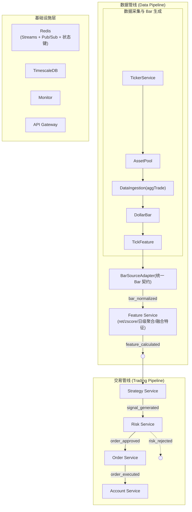
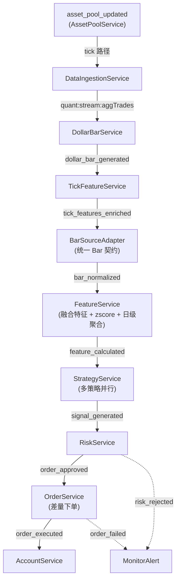
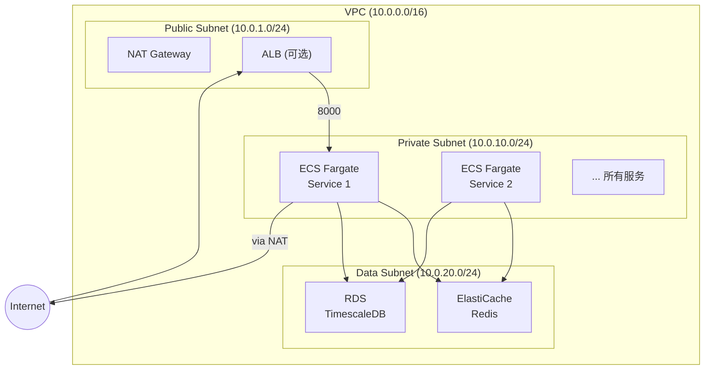
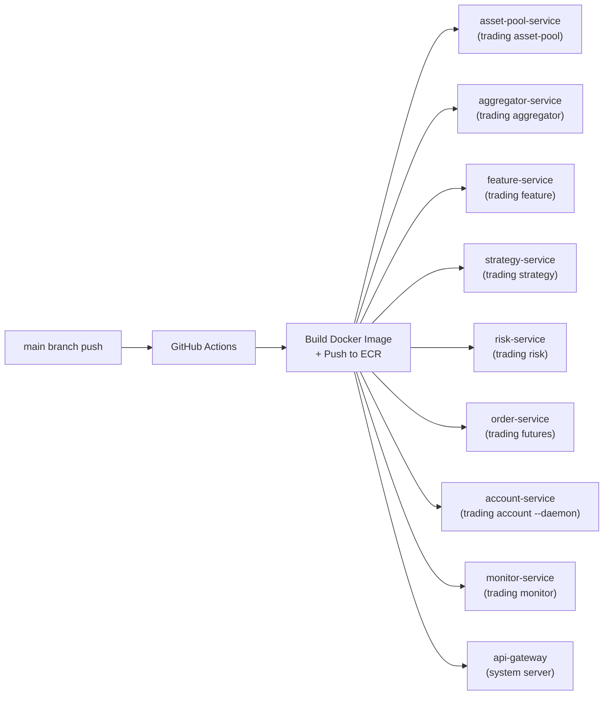
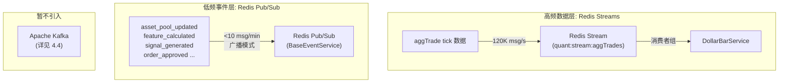

# 工业级量化模拟盘 — 架构设计文档

> 编写时间: 2026-03-03
> 基于: 现有 V0 代码库 + overview/strategy_1.md (Top 10 多因子策略) + overview/strategy_4.md (rev_1d 1d 反转) + overview/strategy_3.md (ofi_14d 单因子动量)
> 前置文档: `docs/overview/01_system_design_v1_v2.md`

---

## 目录

- [一、系统设计 — 解耦与高可用](#system-design)
- [二、目录结构与服务职责](#directory-structure)
- [三、AWS 部署方案](#aws-deployment)
- [四、通信总线选型: Redis vs Kafka](#message-bus)
- [附录 A: 策略兼容性矩阵](#appendix-a)
- [附录 B: Terraform 模块清单](#appendix-b)

---

## 一、系统设计 — 解耦与高可用 {#system-design}

### 1.1 设计原则

| 原则 | 说明 | 在本系统中的体现 |
|------|------|-----------------|
| **事件驱动** | 服务间通过异步事件通信，不直接调用 | Redis Pub/Sub 事件链，`BaseEventService` 抽象 |
| **策略可插拔** | 策略逻辑与执行引擎解耦 | `BaseStrategy` 接口，YAML 配置切换 |
| **数据管线 / 交易管线分离** | 数据采集→特征计算 与 信号→风控→下单 独立运行 | 两条独立事件链，互不阻塞 |
| **故障隔离** | 单服务崩溃不拖垮整个系统 | 独立进程/容器 + Redis 状态缓存 + 自动重启 |
| **幂等恢复** | 服务重启后能从 Redis 缓存恢复状态 | 每个服务启动时从 Redis 加载最新状态 |
| **配置驱动** | 所有参数通过 YAML + 环境变量注入 | Pydantic Settings + YAML config |
| **单输入单输出** | tick 聚合为唯一数据源，下游只消费统一 Bar 契约 | Source Adapter 归一化 + `bar_normalized` 事件 |

### 1.2 整体架构图



### 1.2.1 关键约束

1. tick 聚合产出统一 `Bar` 结构（时间边界、时区、字段语义一致）。
2. 下游 `Feature/Strategy/Risk/Order` 不感知数据来源，只消费 `bar_normalized`。

### 1.3 策略与执行解耦: BaseStrategy 抽象

**现有问题**: `FuturesOrderService` 将策略逻辑 (`_rank_by_momentum`) 和下单逻辑 (`_open_positions`, `_close_all_positions`) 耦合在同一个类中。无法独立测试策略、无法复用到回测、无法同时运行多策略。

**解耦方案**: 引入 `BaseStrategy` 抽象接口，所有策略（包括 strategy_1 的 Top 10、strategy_4 的 rev_1d、strategy_3 的 ofi_14d）实现相同接口:

```python
class BaseStrategy(ABC):
    """所有策略必须实现此接口。回测和实盘共用同一套代码。"""

    rebalance_interval: int = 1       # 换仓周期（交易日数），R1=1, R14=14
    pool_name: str = "default"        # 使用的资产池名称
    min_history_days: int = 0         # 最少历史天数要求（不足则过滤）

    @abstractmethod
    def generate_signal(
        self,
        features: Dict[str, FeatureVector],
        current_positions: Dict[str, float],
        timestamp: datetime,
    ) -> TargetPortfolio:
        """输入特征 → 输出目标仓位权重"""

    def should_skip_rebalance(
        self, n_candidates: int, cross_section_std: float
    ) -> bool:
        """子类可覆写，定义跳过换仓的条件。"""
        return False

@dataclass
class TargetPortfolio:
    positions: Dict[str, TargetPosition]  # symbol -> weight
    strategy_name: str
    signal_timestamp: datetime
    metadata: Dict[str, Any]  # 可选调试信息

@dataclass
class TargetPosition:
    symbol: str
    side: str         # "long" | "short"
    weight: float     # 占总资金的比例, e.g. +0.0167 (= 1/60)
    signal_value: float
    reason: str       # 可读说明
```

**strategy_4 (rev_1d) 实现示例:**

```python
class Rev1dStrategy(BaseStrategy):
    """1d 价格反转策略, 对应 overview/strategy_4.md"""

    def __init__(self, long_n: int = 30, short_n: int = 30):
        self.long_n = long_n
        self.short_n = short_n

    def generate_signal(self, features, current_positions, timestamp):
        signals = {}
        for symbol, feat in features.items():
            z1d = feat.get("zscore_neg_ret_1d")
            if z1d is not None:
                signals[symbol] = z1d

        ranked = sorted(signals.items(), key=lambda x: x[1])
        total = self.long_n + self.short_n
        weight_per_symbol = 1.0 / total

        positions = {}
        for symbol, val in ranked[-self.long_n:]:
            positions[symbol] = TargetPosition(
                symbol=symbol, side="long",
                weight=+weight_per_symbol, signal_value=val,
                reason="rev_1d_long"
            )
        for symbol, val in ranked[:self.short_n]:
            positions[symbol] = TargetPosition(
                symbol=symbol, side="short",
                weight=-weight_per_symbol, signal_value=val,
                reason="rev_1d_short"
            )
        return TargetPortfolio(
            positions=positions,
            strategy_name="rev_1d",
            signal_timestamp=timestamp,
            metadata={"n_candidates": len(signals)},
        )
```

**策略汇总表 (strategy_1 / strategy_4 / strategy_3):**

所有策略共享相同的 `BaseStrategy` 接口，区别仅在 `generate_signal` 内部的信号构造逻辑、换仓周期和所用资产池:

| 策略 | 来源 | 信号公式 | 所需特征 | 换仓 | 资产池 |
|------|------|---------|---------|------|--------|
| rev_x_inv_vpin | strategy_1 Top 1 | `mean(z2h,z4h) × clip(1 - 0.3·vpin_z, 0.3, 1.7)` | ret_2h, ret_4h, tick_vpin_24h | R1 | default |
| rev_vpin_filter_t1.0 | strategy_1 Top 2/3 | `zscore_neg_ret_2h` 仅保留 `zscore_vpin > 1.0` | ret_2h, tick_vpin | R1 | default |
| rev_jump_filter_t1.0 | strategy_1 Top 4/5 | `zscore_neg_ret_2h` 仅保留 `zscore_jump > 1.0` | ret_2h, tick_jump_ratio | R1 | default |
| regime_switch | strategy_1 Top 7 | 高波做趋势, 低波做反转 | ret_2h, volatility | R1 | default |
| rev_1d | strategy_4 | `-zscore(ret_1d, window=30)` | ret_1d | R1 | default |
| ofi_14d | strategy_3 | `zscore(RM_14(ofi_d))` 截面多空 | ofi_d, ofi_14d, dollar_volume_d | R14 | t50_monthly |

### 1.4 事件流设计 (完整)


### 1.5 故障隔离与恢复策略

| 故障场景 | 隔离机制 | 恢复策略 |
|---------|---------|---------|
| 单服务崩溃 | 独立容器, ECS 自动重启 | 启动时从 Redis 加载 asset_pool / features / positions |
| Redis 短暂不可用 | 指数退避重连 (BaseEventService 内置) | 重连后重新订阅, 从 Redis 恢复状态 |
| 交易所 API 限频 | AccountService 统一调用, 其他服务读 Redis | 429 → 退避重试, 最多 3 次 |
| 特征计算超时 | 单 symbol 超时不阻塞其他 symbol | 跳过该 symbol, 下轮重新计算 |
| 下单失败 | OrderService 重试 3 次 + dry-run 模式 | 记录失败订单, emit order_failed 供 Monitor 告警 |
| 策略信号异常 | RiskService 拦截 (最大仓位/最大敞口) | risk_rejected 事件 → 不下单 + 告警 |

### 1.6 数据一致性保障

**问题**: 事件驱动架构中, 服务重启可能丢失 Redis Pub/Sub 消息 (Pub/Sub 无持久化)。

**解决方案 — 双保险机制:**

1. **事件触发 (主路径)**: 正常运行时通过 Pub/Sub 实时触发
2. **定时兜底 (备用路径)**: 每个服务维护 cron 定时器，即使错过事件也能按时执行
   - AssetPoolService: 每 24h 更新
   - StrategyService: 每日 23:59 UTC 触发 (对应 strategy_4 的 same_day 模式)
   - OrderService: 兜底检查目标仓位 vs 实际仓位偏差

3. **关键状态持久化到 Redis**:
   - `quant:state:{service_name}:last_run` — 上次执行时间戳
   - `quant:state:{service_name}:status` — running / idle / error
   - 启动时检查 last_run, 若距今超过阈值则立即补执行
---

## 二、目录结构与服务职责 {#directory-structure}

### 2.1 目标目录树

基于现有 `src/quant_trading/` 结构扩展。已有模块保留，新增模块用 `★` 标注。

```
quant_trading_backend/
├── yamls/                                # YAML 业务配置 (现有)
│   ├── ticker.yaml                       # TickerService 配置
│   ├── account.yaml                      # AccountService 配置
│   ├── exchange.yaml                     # 交易所通用配置
│   ├── strategy_config.yaml              ★ 策略选择 + 参数
│   ├── risk_config.yaml                  ★ 风控规则
│   ├── monitor_config.yaml               ★ 告警阈值 + 渠道
│   ├── ingestion_config.yaml             ★ 数据采集配置
│   └── dollar_bar_config.yaml            ★ Dollar Bar 阈值
│
├── docker/
│   ├── Dockerfile
│   ├── docker-compose.yml
│   └── docker-compose.local.yml          # 本地开发
│
├── infra/                                ★ Terraform IaC
│   ├── main.tf
│   ├── variables.tf
│   ├── outputs.tf
│   ├── terraform.tfvars.example
│   └── modules/
│       ├── vpc/                          ★ 网络
│       ├── ecs/                          ★ ECS 集群 + 服务
│       ├── redis/                        ★ ElastiCache
│       ├── rds/                          ★ TimescaleDB on RDS
│       ├── ecr/                          ★ 容器镜像仓库
│       ├── secrets/                      ★ Secrets Manager
│       ├── monitoring/                   ★ CloudWatch + SNS
│       └── iam/                          ★ IAM 角色
│
├── src/quant_trading/
│   ├── app/
│   │   ├── cli.py                        # Typer CLI 入口
│   │   └── commands/
│   │       ├── _utils.py
│   │       ├── account_service/          # CLI: account-service run
│   │       ├── ticker_service/           # CLI: ticker-service run
│   │       ├── configs/                  # CLI: configs list/generate/load
│   │       ├── strategy_service/         ★ CLI: strategy-service run
│   │       ├── risk_service/             ★ CLI: risk-service run
│   │       └── monitor_service/          ★ CLI: monitor-service run
│   │
│   ├── common/
│   │   ├── configs/
│   │   │   ├── paths.py                  # 配置路径管理
│   │   │   ├── envs/                     # Pydantic 环境配置
│   │   │   │   ├── base.py
│   │   │   │   ├── loader.py
│   │   │   │   └── services/             # account_env, database_env, exchange_env, global_env, redis_env
│   │   │   └── yamls/                    # YAML 配置加载
│   │   │       ├── base.py
│   │   │       ├── loader.py
│   │   │       └── services/             # account_yaml, exchange_yaml, ticker_yaml
│   │   ├── redis/
│   │   │   ├── base_service.py           # BaseEventService
│   │   │   ├── channels.py               # Channels, RedisKeys
│   │   │   ├── client.py                 # RedisClient
│   │   │   └── pubsub.py                 # RedisPubSub, EventMessage
│   │   └── utils/
│   │       ├── config_loader.py
│   │       └── loggers.py
│   │
│   ├── data/
│   │   └── db/                           # SQLAlchemy + TimescaleDB
│   │       ├── database.py               # DatabaseManager
│   │       ├── models/                   # account_model, symbol_ohlcv_model, tick_model
│   │       └── repositories/             # base, account, symbol_ohlcv
│   │
│   ├── services/
│   │   ├── account_service/              # [现有] 账户状态同步
│   │   │   └── service.py                # AccountService
│   │   │
│   │   ├── ticker_service/               # [现有] 行情数据采集
│   │   │   └── service.py                # TickerService
│   │   │
│   │   ├── feature_service/              # [现有] 特征计算
│   │   │   ├── feature_calculator.py     # 基础技术指标
│   │   │   ├── zscore_calculator.py      # Z-Score 标准化
│   │   │   ├── intraday_features.py      # 日内特征
│   │   │   └── service.py                # FeatureService
│   │   │
│   │   │
│   │   ├── data_ingestion_service/       ★ [新增] aggTrade 采集
│   │   │   ├── __init__.py
│   │   │   ├── ingestion_worker.py       # WebSocket aggTrade 采集
│   │   │   ├── stream_writer.py          # 写入 Redis Stream + TimescaleDB
│   │   │   └── service.py
│   │   │
│   │   ├── dollar_bar_service/           ★ [新增] Dollar Bar 聚合
│   │   │   ├── __init__.py
│   │   │   ├── dollar_bar_aggregator.py  # 自适应阈值 + 23 列输出
│   │   │   ├── threshold_tracker.py      # auto_K50_ema 阈值管理
│   │   │   └── service.py
│   │   │
│   │   ├── tick_feature_service/         ★ [新增] Tick 微观特征
│   │   │   ├── __init__.py
│   │   │   ├── tick_features.py          # VPIN / Kyle's Lambda 等 9 个
│   │   │   └── service.py
│   │   │
│   │   ├── strategy_service/             ★ [新增] 策略引擎
│   │   │   ├── __init__.py
│   │   │   ├── base_strategy.py          # BaseStrategy 抽象
│   │   │   ├── registry.py               # 策略注册表 (name → class)
│   │   │   ├── strategies/
│   │   │   │   ├── __init__.py
│   │   │   │   ├── rev_1d.py             # strategy_4: 1d 反转
│   │   │   │   ├── rev_x_inv_vpin.py     # strategy_1 Top 1
│   │   │   │   ├── rev_vpin_filter.py    # strategy_1 Top 2/3
│   │   │   │   ├── rev_jump_filter.py    # strategy_1 Top 4/5
│   │   │   │   ├── rev_noise_boost.py    # strategy_1 Top 6
│   │   │   │   ├── regime_switch.py      # strategy_1 Top 7
│   │   │   │   ├── vol_weighted_blend.py # strategy_1 Top 8
│   │   │   │   ├── quad_blend.py         # strategy_1 Top 9
│   │   │   │   └── ofi_14d.py            ★ strategy_3: OFI 14d 动量
│   │   │   ├── ensemble.py               ★ 多策略集成
│   │   │   └── service.py
│   │   │
│   │   ├── risk_service/                 ★ [新增] 风控
│   │   │   ├── __init__.py
│   │   │   ├── risk_rules.py             # 风控规则引擎
│   │   │   └── service.py
│   │   │
│   │   ├── order_service/                ★ [新增] 纯执行层
│   │   │   ├── __init__.py
│   │   │   ├── position_differ.py        # 目标仓位 vs 当前仓位 差量计算
│   │   │   └── order_executor.py         # 下单 + 重试 + 精度处理
│   │   │
│   │   ├── monitor_service/              ★ [新增] 监控告警
│   │   │   ├── __init__.py
│   │   │   ├── health_checker.py         # 心跳检查
│   │   │   ├── alerter.py                # Webhook 告警 (Telegram)
│   │   │   └── service.py
│   │   │
│   │   └── backtest_engine/              ★ [新增] 回测引擎
│   │       ├── __init__.py
│   │       ├── data_loader.py            # 加载历史数据
│   │       ├── simulator.py              # 回测核心循环
│   │       ├── fee_model.py              # 手续费模型
│   │       ├── metrics.py                # Sharpe / MDD / Calmar
│   │       └── report.py                 # 报告生成
│   │
│   ├── controller/
│   │   ├── gateway/                      # FastAPI 网关
│   │   │   ├── base.py                   # ServiceSpec, BaseServiceApp, ServiceApp
│   │   │   └── specs.py                  # 各服务 App 定义
│   │   ├── routes/
│   │   │   └── account.py                # /api/v1/account/* (现有)
│   │   └── schemas/
│   │       ├── common.py                 # ApiResponse, PaginationParams
│   │       └── account.py                # BalanceResponse, PositionItem 等
│   │
│   └── domain/                           # 领域模型
│       ├── portfolio.py                  # TargetPortfolio / TargetPosition
│       └── features.py                   # FeatureVector 标准接口
│
└── tests/
    ├── conftest.py                       # mock_redis_client 等 fixture
    ├── services/
    │   └── test_ticker_service.py
    ├── common/configs/
    │   ├── test_yaml_loader.py
    │   └── test_env_loader.py
    ├── unit/                             ★ 待补充
    │   ├── test_strategies/
    │   │   ├── test_rev_1d.py            ★
    │   │   └── test_ofi_14d.py           ★
    │   └── test_risk_rules.py            ★
    └── integration/                      ★ 待补充
        └── test_event_flow.py            ★
```

### 2.2 各服务详细职责

#### 2.2.1 Asset Pool Service (扩展 — 多池支持)

| 属性 | 值 |
|------|-----|
| **现有文件** | `services/asset_pool_service/service.py` |
| **订阅事件** | 无 (publish-only) |
| **发布事件** | `asset_pool_updated` |
| **核心逻辑** | 支持多种 pool profile，按不同指标/周期筛选合约池 |
| **调度** | `default` 池每 24h 更新; `t50_monthly` 池每月 1 日更新 |
| **Redis 键** | `quant:asset_pool:{exchange}` (Set, default), `quant:asset_pool:{exchange}:t50_monthly` (Set) |
| **变更** | 新增多池配置、月度流动性池计算逻辑 |

**多池配置 (asset_pool_config.yaml 扩展):**

```yaml
pools:
  default:
    top_k: 100
    metric: usdt_volume_30d
    update_interval: 24h
  t50_monthly:
    top_k: 50
    metric: dollar_volume_monthly   # 按月统计 sum(dollar_volume_d)
    lag: 1                          # 使用上月数据 (1 个月滞后)
    update_interval: monthly        # 每月 1 日更新
    min_history_days: 60            # 历史不足 60 天的标的排除
```

**月度流动性池 T50 计算逻辑 (对应 strategy_3.md Section 4.1):**

```python
def compute_monthly_pool(
    daily_dollar_volumes: Dict[str, Dict[date, float]],
    target_month: date,
    top_k: int = 50,
    min_history_days: int = 60,
) -> List[str]:
    """
    按上月 dollar_volume 总和降序取 Top-K，
    同时过滤历史不足 min_history_days 的标的。
    """
    monthly_totals = {}
    for symbol, date_to_dv in daily_dollar_volumes.items():
        month_days = [d for d in date_to_dv if d.month == target_month.month and d.year == target_month.year]
        if len(date_to_dv) < min_history_days:
            continue
        monthly_totals[symbol] = sum(date_to_dv[d] for d in month_days)
    ranked = sorted(monthly_totals.items(), key=lambda x: x[1], reverse=True)
    return [sym for sym, _ in ranked[:top_k]]
```

#### 2.2.2 Data Ingestion Service (新增)

| 属性 | 值 |
|------|-----|
| **现有参考** | `services/ticker_service/service.py`（TickerService 已采集行情写入 `market:trades`） |
| **新增文件** | `services/data_ingestion_service/`（从 TickerService 演进，增加 aggTrade 专用采集） |
| **订阅事件** | `asset_pool_updated` (更新采集 symbol 列表) |
| **发布** | 写入 Redis Stream `market:trades`（与现有 TickerService 保持一致） |
| **核心逻辑** | 接入 Binance Futures aggTrade WebSocket, 批量写入 TimescaleDB + Redis Stream |
| **容量** | 488 symbols × ~250 ticks/s (峰值) ≈ 120K ticks/s |
| **背压控制** | 内存缓冲 + 每 1s 或 1000 条批量 flush |

#### 2.2.3 Dollar Bar Service (新增)

| 属性 | 值 |
|------|-----|
| **新增文件** | `services/dollar_bar_service/` |
| **订阅** | Redis Stream `market:trades` |
| **发布事件** | `dollar_bar_generated` |
| **核心逻辑** | 按累计 dollar_volume 切分 bar, 阈值 auto_K50_ema 自适应, 输出 23 列 |
| **Redis 键** | `quant:dollar_bar:{symbol}` (List, 保留最近 200 bars) |
| **冷启动** | 预加载最近 7 天 aggTrade 生成种子 bar, 确定初始阈值 |

#### 2.2.4 Tick Feature Service (新增)

| 属性 | 值 |
|------|-----|
| **新增文件** | `services/tick_feature_service/` |
| **订阅事件** | `dollar_bar_generated` |
| **发布事件** | `tick_features_enriched` |
| **核心逻辑** | 对每根 dollar bar, 取 rolling 50 bars 的 tick window, 计算 9 个微观特征 |
| **计算特征** | tick_vpin, tick_toxicity_run_mean/max/ratio, tick_kyle_lambda, tick_burstiness, tick_jump_ratio, tick_whale_imbalance/impact |
| **性能要求** | 使用 NumPy/Polars 向量化, 避免 Python 循环 |
| **兼容性** | Top 1-7 策略依赖；rev_1d 不使用 |

#### 2.2.5 Feature Service (现有 + 扩展)

| 属性 | 值 |
|------|-----|
| **现有文件** | `services/feature_service/service.py` |
| **现有订阅** | `kline_aggregated`（当前从 `quant:kline:{symbol}:{timeframe}` 读取 K 线数据） |
| **目标上游** | `bar_normalized`（V2 统一 Bar 契约，由 BarSourceAdapter 发布） |
| **发布事件** | `feature_calculated` |
| **现有功能** | 基础技术指标 (SMA/EMA 等)、日内收益率 (intraday_features.py)、截面 Z-Score (zscore_calculator.py) |
| **扩展功能** | 日级聚合 (daily_aggregator.py ★)、多日滚动特征 (rolling_features.py ★) |
| **V2 扩展** | BarSourceAdapter 归一化 tick/kline 为统一 Bar → FeatureService 消费 `bar_normalized` |
| **Redis 键** | `quant:features:latest:{symbol}`（保持）, `quant:features:{symbol}:{timestamp}`（保持）, `quant:features:daily:{symbol}` ★ |

**日级聚合层 (daily_aggregator.py) — 对应 strategy_3.md Section 2.3/3.2:**

Bar 级特征在每日 EOD (23:59 UTC) 聚合为日级特征，供中低频策略（如 ofi_14d）消费:

| 日级字段 | 聚合公式 | 来源 |
|---------|---------|------|
| `close_d` | 当日最后一根 bar 的 `close` | bar OHLCV |
| `ret_d` | `close_d / close_{d-1} - 1` | close_d |
| `ofi_d` | 当日所有 bar `buy_sell_imbalance` 的均值 | Dollar Bar 23 列 |
| `dollar_volume_d` | 当日所有 bar `dollar_volume` 之和 | Dollar Bar 23 列 |

```python
def aggregate_daily_features(
    bars_today: List[BarNormalized],
    prev_close: float,
) -> DailyFeatures:
    """将当日所有 bar 聚合为日级特征。"""
    close_d = bars_today[-1].close
    ret_d = close_d / prev_close - 1 if prev_close > 0 else float("nan")
    ofi_d = np.nanmean([b.buy_sell_imbalance for b in bars_today])
    dollar_volume_d = sum(b.dollar_volume for b in bars_today)
    return DailyFeatures(close_d=close_d, ret_d=ret_d, ofi_d=ofi_d, dollar_volume_d=dollar_volume_d)
```

**多日滚动特征 (rolling_features.py) — 对应 strategy_3.md Section 3.3:**

```python
def rolling_mean(values: List[float], window: int = 14) -> float:
    """
    滚动均值，有效值条件: count_valid >= max(floor(w/2), 3)。
    """
    recent = values[-window:]
    valid = [v for v in recent if not math.isnan(v)]
    if len(valid) < max(window // 2, 3):
        return float("nan")
    return sum(valid) / len(valid)
```

`ofi_14d` 因子由 `rolling_mean(ofi_d_series, window=14)` 计算得出。

**Z-Score 计算 (关键):**

```python
def calculate_zscore(values: List[float], window: int = 30, negate: bool = False) -> float:
    """
    时序 Z-Score, shift(1) 避免 look-ahead bias。
    negate=True 用于反转信号: 价格跌 → zscore 正 → 做多。
    """
    if len(values) < window + 1:
        return float("nan")
    # shift(1): 只用截至前一根 bar 的数据
    historical = values[-(window + 1):-1]
    current = values[-1]
    mean = sum(historical) / len(historical)
    std = (sum((x - mean) ** 2 for x in historical) / len(historical)) ** 0.5
    if std < 1e-10:
        return 0.0
    zscore = (current - mean) / std
    return -zscore if negate else zscore
```
#### 2.2.7 Strategy Service (新增)

| 属性 | 值 |
|------|-----|
| **新增文件** | `services/strategy_service/` |
| **订阅事件** | `feature_calculated` |
| **发布事件** | `signal_generated` |
| **核心逻辑** | 加载配置中指定的策略, 调用 `generate_signal()`, 输出 TargetPortfolio |
| **多策略支持** | StrategyRegistry 注册表 + ensemble 加权聚合 |
| **调度** | 按策略独立换仓周期调度: R1 策略每日 23:59 UTC 触发, R14 策略每 14 个交易日触发 |
| **资产池路由** | 根据策略配置的 `pool_name` 从对应的 Redis 池键读取候选标的 |

**策略注册表设计:**

```python
class StrategyRegistry:
    """通过 YAML 配置动态加载策略。"""
    _registry: Dict[str, Type[BaseStrategy]] = {}

    @classmethod
    def register(cls, name: str):
        def decorator(strategy_cls):
            cls._registry[name] = strategy_cls
            return strategy_cls
        return decorator

    @classmethod
    def create(cls, name: str, **kwargs) -> BaseStrategy:
        return cls._registry[name](**kwargs)

# 使用:
@StrategyRegistry.register("rev_1d")
class Rev1dStrategy(BaseStrategy): ...

@StrategyRegistry.register("rev_x_inv_vpin")
class RevXInvVpinStrategy(BaseStrategy): ...

@StrategyRegistry.register("ofi_14d")
class Ofi14dStrategy(BaseStrategy): ...
```

**strategy_3 (ofi_14d) 实现示例:**

```python
@StrategyRegistry.register("ofi_14d")
class Ofi14dStrategy(BaseStrategy):
    """OFI 14 日动量策略, 对应 overview/strategy_3.md"""

    rebalance_interval = 14
    pool_name = "t50_monthly"
    min_history_days = 60

    def __init__(self, long_n: int = 15, short_n: int = 15, min_candidates: int = 30):
        self.long_n = long_n
        self.short_n = short_n
        self.min_candidates = min_candidates

    def generate_signal(self, features, current_positions, timestamp):
        signals = {}
        for symbol, feat in features.items():
            ofi_14d_value = feat.get("ofi_14d")
            if ofi_14d_value is not None and not math.isnan(ofi_14d_value):
                signals[symbol] = ofi_14d_value

        if self.should_skip_rebalance(len(signals), self._cross_section_std(signals)):
            return TargetPortfolio(
                positions={}, strategy_name="ofi_14d",
                signal_timestamp=timestamp, metadata={"skipped": True},
            )

        ranked = sorted(signals.items(), key=lambda x: x[1])
        weight_long = 0.5 / self.long_n
        weight_short = 0.5 / self.short_n

        positions = {}
        for symbol, val in ranked[-self.long_n:]:
            positions[symbol] = TargetPosition(
                symbol=symbol, side="long",
                weight=+weight_long, signal_value=val, reason="ofi_14d_long",
            )
        for symbol, val in ranked[:self.short_n]:
            positions[symbol] = TargetPosition(
                symbol=symbol, side="short",
                weight=-weight_short, signal_value=val, reason="ofi_14d_short",
            )
        return TargetPortfolio(
            positions=positions, strategy_name="ofi_14d",
            signal_timestamp=timestamp, metadata={"n_candidates": len(signals)},
        )

    def should_skip_rebalance(self, n_candidates: int, cross_section_std: float) -> bool:
        if n_candidates < self.min_candidates:
            return True
        if cross_section_std < 1e-10:
            return True
        return False

    @staticmethod
    def _cross_section_std(signals: Dict[str, float]) -> float:
        if not signals:
            return 0.0
        values = list(signals.values())
        mean_val = sum(values) / len(values)
        return (sum((v - mean_val) ** 2 for v in values) / len(values)) ** 0.5
```

**StrategyService 灵活换仓调度:**

```python
class StrategyService:
    def on_feature_calculated(self, features, timestamp):
        trading_day_index = self._get_trading_day_index(timestamp)

        for strategy_config in self.active_strategies:
            strategy = StrategyRegistry.create(strategy_config.name, **strategy_config.parameters)
            rebalance_interval = strategy.rebalance_interval

            if trading_day_index > 0 and trading_day_index % rebalance_interval != 0:
                continue

            pool_symbols = self._load_pool(strategy.pool_name)
            filtered_features = {s: features[s] for s in pool_symbols if s in features}
            target = strategy.generate_signal(filtered_features, self.current_positions, timestamp)
            self.emit_signal(target)
```

**多策略集成配置 (strategy_config.yaml):**

```yaml
# 单策略模式
mode: single
active_strategy: rev_1d
parameters:
  long_n: 30
  short_n: 30
  rebalance_days: 1             # R1 = 每日换仓

# 或: 多策略集成模式
# mode: ensemble
# ensemble_method: weighted_average
# strategies:
#   - name: rev_x_inv_vpin
#     weight: 0.3
#     pool: default
#     rebalance_days: 1
#     parameters: { long_n: 10, short_n: 10 }
#   - name: rev_1d
#     weight: 0.3
#     pool: default
#     rebalance_days: 1
#     parameters: { long_n: 30, short_n: 30 }
#   - name: ofi_14d
#     weight: 0.4
#     pool: t50_monthly
#     rebalance_days: 14
#     parameters:
#       long_n: 15
#       short_n: 15
#       min_candidates: 30
#       min_history_days: 60
```

#### 2.2.8 Risk Service (新增)

| 属性 | 值 |
|------|-----|
| **新增文件** | `services/risk_service/` |
| **订阅事件** | `signal_generated` |
| **发布事件** | `order_approved` 或 `risk_rejected` |
| **核心逻辑** | 对 TargetPortfolio 逐条规则检查, 全部通过才 emit order_approved |

**风控规则配置 (risk_config.yaml):**

```yaml
max_position_pct: 0.15        # 单币种最大仓位占比
max_total_exposure: 1.0       # 最大总敞口 (|多头| + |空头|)
max_drawdown_halt: 0.30       # 触发暂停交易的最大回撤
min_balance_reserve: 100      # 最低保留余额 (USDT)
max_order_value: 5000         # 单笔订单最大金额 (USDT)
max_daily_turnover: 3.0       # 每日最大换手率
blacklist: []                 # 禁止交易的币种
```

#### 2.2.9 Order Service (重构)

| 属性 | 值 |
|------|-----|
| **现有文件** | `services/order_service/futures_service.py` |
| **变更** | 移除策略逻辑 (`_rank_by_momentum`), 只保留下单执行 |
| **订阅事件** | `order_approved` |
| **发布事件** | `order_executed` / `order_failed` |
| **新增** | `position_differ.py` (差量计算), `order_executor.py` (重试 + 精度) |
| **Dry-run** | 配置 `dry_run: true` 时只记录不实际下单 |

**差量计算逻辑:**

```
target_positions (来自 StrategyService)
    - current_positions (来自 AccountService via Redis)
    = delta_orders (需要执行的订单列表)

对每个 delta_order:
    if delta > 0: buy
    if delta < 0: sell
    if delta ≈ 0: skip (低于最小下单量)
```

#### 2.2.10 Account Service (新增)

| 属性 | 值 |
|------|-----|
| **新增文件** | `services/account_service/` |
| **核心逻辑** | 定时轮询 (30s) 交易所 API, 同步余额/仓位/挂单到 Redis |
| **发布事件** | `account_updated` |
| **Redis 键** | `quant:account:balance`, `quant:account:positions`, `quant:account:orders` |
| **设计要点** | 统一调用入口, 避免多个服务同时调用交易所 API 导致限频 |

#### 2.2.11 Monitor Service (新增)

| 属性 | 值 |
|------|-----|
| **新增文件** | `services/monitor_service/` |
| **订阅事件** | 所有事件 (用于延迟检测) |
| **核心功能** | 心跳检查、数据延迟告警、异常仓位检测、资金变动告警 |
| **告警渠道** | Webhook → Telegram / DingTalk |

**心跳机制:**

```
每个服务定期写入 Redis:
    key = quant:heartbeat:{service_name}
    value = { timestamp, status, metrics }
    TTL = 120s

Monitor Service 每 30s 扫描:
    若某服务 heartbeat 过期 → 告警
```

#### 2.2.12 Backtest Engine (新增)

| 属性 | 值 |
|------|-----|
| **新增文件** | `services/backtest_engine/` |
| **核心原则** | 与实盘共用 BaseStrategy 代码, 策略无需感知回测 vs 实盘 |
| **数据输入** | 从 Parquet / CSV / Redis 加载历史 kline 或 dollar bar |
| **输出指标** | Sharpe, MDD, Calmar, 年化收益率, 换手率, NAV 曲线 |
| **CLI** | `main backtest run --strategy rev_1d --start 2024-01-01 --end 2025-01-01` |

**回测核心循环 (对应 overview/strategy_1.md Stage 6):**

```python
for date in all_trading_dates:
    # 1. 计算当日 PnL (用旧权重)
    daily_pnl = sum(weight[sym] * daily_return[sym] for sym in portfolio)

    # 2. 在换仓日, 调用 strategy.generate_signal()
    if is_rebalance_day(date, rebalance_interval):
        features = feature_store.get_features(date)
        target = strategy.generate_signal(features, current_weights, date)
        turnover = sum(abs(target[sym] - current_weights[sym]) for sym in all_symbols)
        daily_pnl -= turnover * fee_rate
        current_weights = target

    # 3. 更新 NAV
    nav_curve.append(nav_curve[-1] * (1 + daily_pnl))
```

### 2.3 Redis 通道 / 键扩展清单

**新增 Pub/Sub 通道 (在 `channels.py` 中扩展):**

| 通道 | 发布者 | 订阅者 |
|------|-------|-------|
| `quant:kline_aggregated` | AggregatorService | FeatureService |
| `quant:order_rebalanced` | OrderService | MonitorService |
| `quant:dollar_bar_generated` | DollarBarService ★ | TickFeatureService ★ |
| `quant:tick_features_enriched` | TickFeatureService ★ | BarSourceAdapter ★ |
| `quant:bar_normalized` | BarSourceAdapter ★ | FeatureService |
| `quant:signal_generated` | StrategyService | RiskService |
| `quant:order_approved` | RiskService | OrderService |
| `quant:risk_rejected` | RiskService | MonitorService |
| `quant:order_executed` | OrderService | AccountService, MonitorService |
| `quant:order_failed` | OrderService | MonitorService |
| `quant:account_updated` | AccountService | RiskService |

**新增 Redis 键:**

| 键模式 | 类型 | 用途 |
|-------|------|------|
| `market:trades` | Stream | aggTrade / trades 实时数据 (MAXLEN ~100000) |
| `market:tickers` | Stream | 聚合行情快照 |
| `market:ohlcv` | Stream | K 线数据 |
| `quant:dollar_bar:{symbol}` | List | Dollar Bar 缓存 (最近 200 bars) |
| `quant:bar:normalized:{symbol}:{timeframe}` | String (JSON) | 统一 Bar 快照 |
| `quant:asset_pool:{exchange}:t50_monthly` | Set | ★ T50 月度流动性池 |
| `quant:features:daily:{symbol}` | String (JSON) | ★ 日级聚合特征缓存 (ofi_d, dollar_volume_d 等) |
| `quant:features:rolling:{symbol}` | String (JSON) | ★ 多日滚动特征缓存 (ofi_14d 等) |
| `quant:kline:{symbol}:{timeframe}` | String (JSON) | Kline 数据缓存 |
| `quant:account:balance` | String (JSON) | 账户余额快照 |
| `quant:account:positions` | String (JSON) | 当前持仓快照 |
| `quant:account:orders` | String (JSON) | 活跃挂单快照 |
| `quant:positions` | String (JSON) | 策略当前仓位 |
| `quant:portfolio:snapshot` | String (JSON) | NAV / PnL / 回撤等组合指标快照 |
| `quant:signal:latest` | String (JSON) | 最新策略信号 |
| `quant:heartbeat:{service}` | String (JSON + TTL) | 服务心跳 |
| `quant:state:{service}:last_run` | String | 上次执行时间戳 |
| `quant:state:{service}:status` | String | 服务状态 (running / idle / error) |
| `quant:risk:status` | String | 风控总体状态 |
| `quant:risk:disabled_symbols` | String | 风控禁止交易的 symbols |
| `quant:system:emergency_stop` | String | 全局紧急停止开关 |

---
## 三、AWS 部署方案 {#aws-deployment}

### 3.1 是否使用 Terraform?

**结论: 是, 推荐使用 Terraform 管理所有 AWS 基础设施。**

| 维度 | 不用 Terraform (现状) | 使用 Terraform |
|------|---------------------|---------------|
| 环境一致性 | 手动创建, 易出错 | 代码即基础设施, 可重复部署 |
| 多环境支持 | 难以维护 staging / prod | `terraform workspace` 切换 |
| 变更追踪 | 无法审计 | Git 版本控制 + `terraform plan` 预览 |
| 灾难恢复 | 需要手工重建 | `terraform apply` 一键恢复 |
| 团队协作 | 口口相传 | 代码 Review + CI 自动化 |
| 学习成本 | 低 | 中等 (一次性投入) |

**当前项目已有** ECS Fargate + ECR + GitHub Actions CI/CD, Terraform 可以将这些资源编码化。

### 3.2 是否使用多节点?

**结论: 多服务、单集群、按需扩缩。**

不建议 "多节点" (多 EC2 集群), 而是继续使用 **ECS Fargate** — 每个服务是独立的 ECS Service (独立 Task Definition), 共享一个 ECS Cluster。Fargate 自动管理底层节点, 无需手动运维 EC2。

**各服务资源配置建议:**

| 服务 | CPU | Memory | 实例数 | 说明 |
|------|-----|--------|--------|------|
| Asset Pool Service | 256 | 512 MB | 1 | 低频, 每 24h 执行一次 |
| Data Ingestion Service | 1024 | 2 GB | 1 | 高吞吐, WebSocket 连接池 |
| Dollar Bar Service | 512 | 1 GB | 1 | 实时计算 |
| Tick Feature Service | 1024 | 2 GB | 1 | 向量化计算, 内存密集 |
| Feature Service | 512 | 1 GB | 1 | |
| Strategy Service | 256 | 512 MB | 1 | 轻量计算 |
| Risk Service | 256 | 512 MB | 1 | 规则检查 |
| Order Service | 256 | 512 MB | 1 | API 调用 |
| Account Service | 256 | 512 MB | 1 | 定时轮询 |
| Monitor Service | 256 | 512 MB | 1 | 心跳检查 |
| API Gateway | 512 | 1 GB | 1-2 | 按访问量扩 |
| **总计** | | | **11-12** | Fargate 按使用计费 |

**月费估算 (ap-southeast-1):**

```
ECS Fargate:
  11 tasks × 平均 0.5 vCPU × 1 GB × 730h ≈ $35-50/月

ElastiCache Redis (cache.t3.small):
  ≈ $25/月

RDS TimescaleDB (db.t3.small):
  ≈ $30/月 (含 20GB GP3 存储)

NAT Gateway:
  ≈ $35/月 (固定) + 数据传输费

ECR:
  < $5/月

CloudWatch:
  ≈ $10/月

总计: ≈ $140-160/月
```

### 3.3 网络架构



**安全组规则:**

| 组 | 入站 | 出站 |
|----|------|------|
| ECS Services | 仅 ALB (8000 端口) | Redis (6379), TimescaleDB (5432), 互联网 (via NAT) |
| Redis | 仅 ECS SG (6379) | 无 |
| TimescaleDB | 仅 ECS SG (5432) | 无 |

### 3.4 密钥管理

**现有问题**: API Key 和 Private Key 通过 `.env` 文件和环境变量传递, 存储在 `configs/` 目录中。

**生产方案**: AWS Secrets Manager

```
secrets/
  quant/exchange/api_key         → EXCHANGE_API_KEY
  quant/exchange/private_key     → EXCHANGE_PRIVATE_KEY (PEM 内容)
  quant/db/password              → DB_PASSWORD
  quant/telegram/bot_token       → TELEGRAM_BOT_TOKEN (告警用)
```

ECS Task Definition 通过 `secrets` 字段引用:

```json
{
  "containerDefinitions": [{
    "secrets": [
      { "name": "EXCHANGE_API_KEY", "valueFrom": "arn:aws:secretsmanager:...:quant/exchange/api_key" },
      { "name": "EXCHANGE_PRIVATE_KEY", "valueFrom": "arn:aws:secretsmanager:...:quant/exchange/private_key" }
    ]
  }]
}
```

### 3.5 CI/CD 流程 (扩展)

现有的 GitHub Actions workflow 只部署单容器。扩展为多服务部署（每个服务独立的 ECS Task Definition，但共用同一个 Docker 镜像，区别仅在 command 参数不同）:



### 3.6 Terraform 模块结构

```
infra/
├── main.tf                 # Root module, 组合所有子模块
├── variables.tf            # 全局变量 (region, env, project_name)
├── outputs.tf              # 输出值 (ALB DNS, Redis endpoint 等)
├── terraform.tfvars.example
├── backend.tf              # S3 + DynamoDB 远端状态
│
└── modules/
    ├── vpc/
    │   ├── main.tf         # VPC, subnets, NAT, IGW, route tables
    │   ├── variables.tf
    │   └── outputs.tf
    │
    ├── ecr/
    │   ├── main.tf         # ECR repository
    │   └── ...
    │
    ├── ecs/
    │   ├── main.tf         # ECS Cluster
    │   ├── services.tf     # 每个服务的 Task Definition + Service
    │   ├── iam.tf          # Task execution role, task role
    │   └── ...
    │
    ├── redis/
    │   ├── main.tf         # ElastiCache Redis cluster
    │   └── ...
    │
    ├── rds/
    │   ├── main.tf         # RDS PostgreSQL (TimescaleDB AMI)
    │   └── ...
    │
    ├── secrets/
    │   ├── main.tf         # Secrets Manager entries
    │   └── ...
    │
    └── monitoring/
        ├── main.tf         # CloudWatch Log Groups, Alarms, SNS
        └── ...
```

**Root module 示例 (main.tf):**

```hcl
module "vpc" {
  source = "./modules/vpc"
  project_name = var.project_name
  environment  = var.environment
}

module "redis" {
  source     = "./modules/redis"
  vpc_id     = module.vpc.vpc_id
  subnet_ids = module.vpc.data_subnet_ids
  security_group_ids = [module.vpc.redis_sg_id]
}

module "rds" {
  source     = "./modules/rds"
  vpc_id     = module.vpc.vpc_id
  subnet_ids = module.vpc.data_subnet_ids
  security_group_ids = [module.vpc.rds_sg_id]
}

module "ecs" {
  source     = "./modules/ecs"
  vpc_id     = module.vpc.vpc_id
  subnet_ids = module.vpc.private_subnet_ids
  redis_endpoint = module.redis.endpoint
  db_endpoint    = module.rds.endpoint
  ecr_repo_url   = module.ecr.repository_url
}
```

---

## 四、通信总线选型: Redis vs Kafka {#message-bus}

### 4.1 系统内的通信类型分析

本系统存在两类截然不同的通信模式:

| 类型 | 吞吐量 | 延迟要求 | 消息大小 | 持久化需求 | 示例 |
|------|--------|---------|---------|-----------|------|
| **高频数据流** | 高 (120K msg/s 峰值) | 低 (<100ms) | 小 (~200B) | 短期 (几小时) | aggTrade tick 数据 |
| **低频事件** | 低 (<10 msg/min) | 中 (<1s) | 中 (~1KB) | 不需要 | feature_calculated, signal_generated |

### 4.2 Redis vs Kafka 对比

| 维度 | Redis Pub/Sub | Redis Streams | Apache Kafka |
|------|--------------|---------------|-------------|
| **消息模型** | 发布/订阅, fire-and-forget | 日志型, 持久化, 消费者组 | 日志型, 持久化, 消费者组 |
| **消息持久化** | 无 (订阅者不在线则丢失) | 有 (MAXLEN 限制) | 有 (可配置保留期) |
| **吞吐量** | ~100K msg/s (单节点) | ~100K msg/s (单节点) | ~1M msg/s (集群) |
| **延迟** | <1ms | <2ms | 5-15ms |
| **运维复杂度** | 极低 (已部署) | 低 (复用 Redis) | 高 (ZooKeeper/KRaft + Broker) |
| **AWS 托管成本** | ElastiCache 包含 | ElastiCache 包含 | MSK ~$200-400/月 (最小集群) |
| **消费者组** | 不支持 | 支持 (XREADGROUP) | 支持 |
| **消息回放** | 不支持 | 支持 (从指定 ID 开始读) | 支持 (从指定 offset 读) |
| **背压处理** | 无 (慢消费者被跳过) | MAXLEN 自动裁剪 | 消费者自主控制 |
| **社区生态** | 成熟 | 成熟 | 非常成熟 |

### 4.3 推荐方案



### 4.4 为什么暂不引入 Kafka?

| 考虑因素 | 分析 |
|---------|------|
| **数据量级** | 488 symbols × ~250 ticks/s (峰值) ≈ 120K msg/s。Redis Streams 在单节点即可轻松处理这个量级。Kafka 的优势在百万级 msg/s 才凸显。 |
| **运维成本** | Kafka 需要 ZooKeeper/KRaft 集群 + 多 Broker。AWS MSK 最小 3 节点, 月费 $200-400。Redis 已经部署, Streams 功能零额外成本。 |
| **团队规模** | 目前是小团队 / 个人项目。Kafka 的运维、调优、监控需要投入大量精力。Redis 几乎零运维。 |
| **消息语义** | 本系统的低频事件不需要 exactly-once 语义。at-most-once (Pub/Sub) + 定时兜底 已经足够。高频数据层用 Streams 的 at-least-once 即可。 |
| **已有投入** | 现有 `BaseEventService` + `RedisPubSub` 已经稳定运行。替换为 Kafka 需要重写所有服务的通信层。|
| **延迟** | Redis (<2ms) 优于 Kafka (5-15ms)。对于量化交易, 更低的延迟是优势。|

### 4.5 Redis Streams 的使用方式

**高频数据链路: DataIngestionService → DollarBarService**

```python
# DataIngestionService: 写入 Redis Stream
async def write_to_stream(self, symbol: str, trade: dict):
    stream_key = "market:trades"
    await self.redis.xadd(
        stream_key,
        trade,
        maxlen=100000,      # 自动裁剪, 防止内存膨胀
        approximate=True,   # 近似裁剪, 性能更好
    )

# DollarBarService: 消费者组读取
async def consume_trades(self, symbol: str):
    stream_key = "market:trades"
    group = "dollar_bar_consumers"
    consumer = f"dollar_bar_{symbol}"

    # 创建消费者组 (幂等)
    try:
        await self.redis.xgroup_create(stream_key, group, id="0", mkstream=True)
    except Exception:
        pass  # 组已存在

    while self._running:
        messages = await self.redis.xreadgroup(
            group, consumer,
            streams={stream_key: ">"},  # 只读新消息
            count=100,                  # 批量读取
            block=1000,                 # 阻塞等待 1s
        )
        for stream, entries in messages:
            for msg_id, trade_data in entries:
                self._process_trade(symbol, trade_data)
                await self.redis.xack(stream_key, group, msg_id)
```

### 4.6 何时迁移到 Kafka?

如果未来遇到以下任一情况, 可考虑引入 Kafka:

| 触发条件 | 说明 |
|---------|------|
| Redis 内存超过 8GB | aggTrade 数据量过大, Redis Streams 占用内存过多 |
| 需要多天消息回放 | Redis Streams 的 MAXLEN 限制了回放窗口 |
| 多系统消费同一数据 | 如需要同时供给回测系统 / 风控系统 / 监控系统 |
| 吞吐突破 500K msg/s | Redis 单节点的吞吐上限 |
| 需要 exactly-once 语义 | 对订单相关事件的严格要求 |

**迁移路径:**
1. 先在高频数据链路 (aggTrade → Dollar Bar) 替换 Redis Streams → Kafka
2. 低频事件链路保持 Redis Pub/Sub 不变
3. 为 `BaseEventService` 增加 Kafka backend 适配器, 上层服务代码无需修改

---

## 附录 A: 策略兼容性矩阵 {#appendix-a}

本架构同时兼容 strategy_4 (rev_1d)、strategy_1 (Top 10 多因子) 和 strategy_3 (ofi_14d):

| 数据/特征需求 | strategy_4 (rev_1d) | strategy_1 (Top 10) | strategy_3 (ofi_14d) | 提供服务 |
|-------------|:---:|:---:|:---:|------|
| 资产池筛选 (default Top-100) | ✅ | ✅ | ❌ | AssetPoolService |
| 月度流动性池 (T50) | ❌ | ❌ | ✅ | AssetPoolService (扩展) |
| Tick 聚合输入 (aggTrade) | ✅ | ✅ | ✅ (Dollar Bar 来源) | DataIngestionService |
| Tick 聚合 Bar (Dollar Bar) | ✅ | ✅ | ✅ (buy_sell_imbalance) | DollarBarService |
| Tick 微观特征 (9 个) | ❌ | ✅ (Top 1-7) | ❌ | TickFeatureService |
| 日内 ret (1d) | ✅ | ✅ | ❌ | FeatureService |
| 日级聚合 (ofi_d, dollar_volume_d) | ❌ | ❌ | ✅ | FeatureService (扩展) |
| 多日滚动特征 (ofi_14d) | ❌ | ❌ | ✅ | FeatureService (扩展) |
| Z-Score 标准化 | ✅ | ✅ | ✅ (截面) | FeatureService |
| 历史长度过滤 (≥60 天) | ❌ | ❌ | ✅ | AssetPoolService / StrategyService |
| 灵活换仓周期 | R1 | R1 | R14 | StrategyService |
| 多策略并行 | 单策略 | 多策略集成 | 可独立或集成 | StrategyService |
| 风控检查 | ✅ | ✅ | ✅ | RiskService |
| 市价单执行 | ✅ | ✅ | ✅ | OrderService |

**分阶段实施:**

| 阶段 | 可运行的策略 | 需要的服务 |
|------|-----------|-----------|
| **V1** (MVP) | strategy_4 (rev_1d) | AssetPool + DataIngestion + DollarBar + Feature + Strategy + Risk + Order |
| **V1.5** (可选扩展) | V1 + strategy_3 (ofi_14d) | V1 + AssetPool 多池扩展 + FeatureService 日级聚合 |
| **V2** (全量多因子) | strategy_1 + strategy_4 + strategy_3 全部 | V1 + TickFeature + BarSourceAdapter + 多策略集成 |

## 附录 B: Terraform 模块清单 {#appendix-b}

| 模块 | 资源 | 关键参数 |
|------|------|---------|
| `vpc` | VPC, 3 Subnet (Public/Private/Data), NAT Gateway, IGW, Route Tables | CIDR: 10.0.0.0/16 |
| `ecr` | ECR Repository | 镜像保留策略: 最近 10 个 |
| `ecs` | ECS Cluster, 11 个 Task Definition + Service, Auto Scaling | 见 3.2 资源表 |
| `redis` | ElastiCache Redis (cache.t3.small, 单节点) | Port 6379, maxmemory-policy: allkeys-lru |
| `rds` | RDS PostgreSQL 16 (db.t3.small) + TimescaleDB 扩展 | Port 5432, 20GB GP3 |
| `secrets` | Secrets Manager × 4 (API Key, Private Key, DB Password, Telegram Token) | 自动轮转: 关闭 |
| `monitoring` | CloudWatch Log Groups (每服务一个), Alarms (CPU/Memory/Error), SNS Topic | 告警 → Email/Webhook |
| `iam` | ECS Task Execution Role (ECR + Secrets + CW), Task Role (S3 可选) | 最小权限原则 |

---

## 附录 C: 配置文件模板

### asset_pool_config.yaml

```yaml
pools:
  default:
    top_k: 100
    metric: usdt_volume_30d
    update_interval: 24h

  t50_monthly:
    top_k: 50
    metric: dollar_volume_monthly
    lag: 1                        # 使用上月数据
    update_interval: monthly
    min_history_days: 60          # 历史不足 60 天排除
```

### strategy_config.yaml

```yaml
mode: single                    # single | ensemble
active_strategy: rev_1d

# 单策略参数
parameters:
  long_n: 30
  short_n: 30
  rebalance_days: 1             # R1 = 每日换仓

# 多策略集成 (mode: ensemble 时生效)
# mode: ensemble
# ensemble_method: weighted_average
# strategies:
#   - name: rev_x_inv_vpin
#     weight: 0.3
#     pool: default
#     rebalance_days: 1
#     parameters:
#       long_n: 10
#       short_n: 10
#   - name: rev_1d
#     weight: 0.3
#     pool: default
#     rebalance_days: 1
#     parameters:
#       long_n: 30
#       short_n: 30
#   - name: ofi_14d
#     weight: 0.4
#     pool: t50_monthly
#     rebalance_days: 14
#     parameters:
#       long_n: 15
#       short_n: 15
#       min_candidates: 30
#       min_history_days: 60

# 调度
cron_enabled: true
cron_schedule: "59 23 * * *"    # 每日 23:59 UTC (same_day 模式)
```
### risk_config.yaml

```yaml
max_position_pct: 0.15
max_total_exposure: 1.0
max_drawdown_halt: 0.30
min_balance_reserve: 100.0
max_order_value: 5000.0
max_daily_turnover: 3.0
blacklist: []
dry_run: true                   # 模拟盘默认 true
```

### monitor_config.yaml

```yaml
heartbeat_check_interval: 30    # 秒
heartbeat_timeout: 120          # 秒, 超过则告警

alerts:
  data_delay_threshold: 300     # 秒, 最新 kline 延迟告警
  balance_drop_threshold: 0.05  # 5% 余额下降告警
  position_mismatch_threshold: 0.1  # 目标 vs 实际仓位偏差 10%

webhook:
  enabled: true
  url: ""                       # Telegram Bot API URL
  channel_id: ""                # Telegram Chat ID
```


