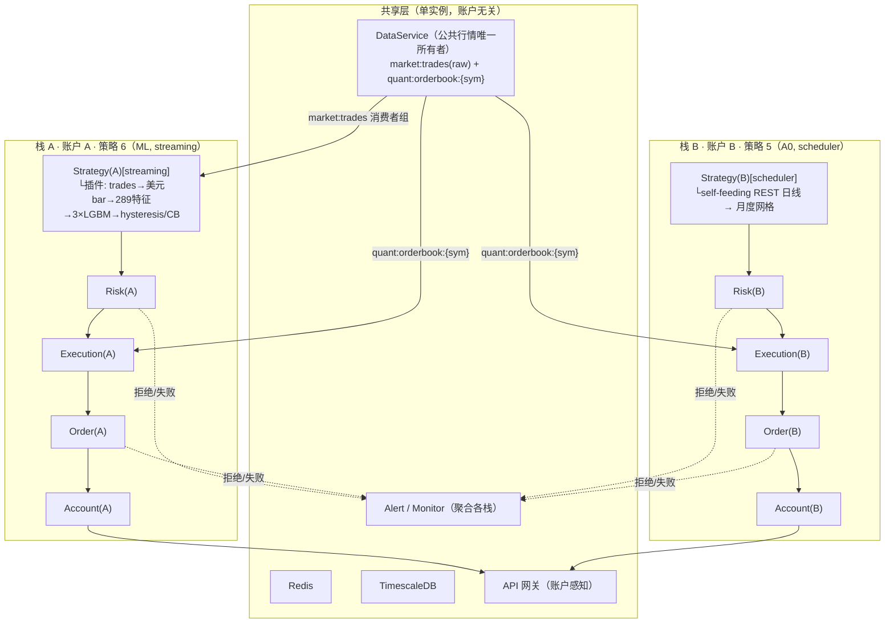

# 架构设计

> 本文是系统架构的**唯一权威**：模块职责、模块之间的 seam、Redis 命名空间约定都在此定稿。API 细节见 [Redis](../api/redis.md) / [HTTP](../api/http.md) / [WebSocket](../api/websocket.md) / [CLI](../api/cli.md)；表结构见 [数据库设计](database.md)；两个策略的本体见 [策略 5](../overview/strategy_5.md) / [策略 6](../overview/strategy_6.md)。

## 一、定位与目标

基于 Binance USDT 永续的量化执行后端。**目标形态：每个策略绑定一个独立（子）账户，自成一条竖直栈；多策略 = 多账户 = 多栈，共享只有公共行情与基础设施。** 当前要跑两个策略（[策略 5 · A0 大币-山寨](../overview/strategy_5.md)、[策略 6 · ML 美元 bar](../overview/strategy_6.md)），架构按 N 栈泛化，新增策略 = 加一个账户 + 一条栈。

闭环：

> 信号 → 风控 sizing → 执行校验 → 下单 → 账户同步

## 二、设计原则

| 原则 | 含义 | 体现 |
|------|------|------|
| **账户级隔离** | 每个策略绑独立（子）账户、自成竖直栈，物理隔离、互不踩仓 | N 条 Strategy→Risk→Execution→Order→Account 栈 |
| **策略自包含** | 复杂策略自取数据、自算特征、自持状态，只向下游交目标组合 | 两种 self-feeding 形态（scheduler / streaming） |
| **account-scoped keyspace** | 「按账户给 Redis 键/频道加作用域」收在一个 adapter 里，服务只说逻辑键名 | Keyspace 模块（§六），不是散落在每个服务里的字符串约定 |
| **目标组合是一等概念** | 「一个完整带符号权重目标 + 对当前持仓做差量」是一个模块，不是一条散文纪律 | Target Portfolio 模块（§五） |
| **公共行情单一所有者** | 公共行情（trades / orderbook）由 DataService 独占采集，下游只读 | DataService → `market:trades` / `quant:orderbook:*` |
| **不为「没有人」建 seam** | 通用流式 bar→feature 链在出现第二个真实消费者前不建 | 延迟项（§八） |
| **配置即代码** | 参数走 YAML + git + 重启，运行时只开关不改参 | 见 [HTTP §策略 API](../api/http.md) |

## 三、拓扑：N 账户 = N 竖直栈 + 共享层 {#account-stacks}


```mermaid
flowchart TD
    subgraph shared ["共享层（单实例，账户无关）"]
        Data["DataService（公共行情唯一所有者）\nmarket:trades(raw) + quant:orderbook:{sym}"]
        Redis["Redis"]
        DB["TimescaleDB"]
        API["API 网关（账户感知）"]
        Alert["Alert / Monitor（聚合各栈）"]
    end

    subgraph stackA ["栈 A · 账户 A · 策略 6（ML, streaming）"]
        S1["Strategy(A)[streaming]\n└插件: trades→美元bar→289特征→3×LGBM→hysteresis/CB"]
        S1 --> R1["Risk(A)"] --> E1["Execution(A)"] --> O1["Order(A)"] --> Ac1["Account(A)"]
    end

    subgraph stackB ["栈 B · 账户 B · 策略 5（A0, scheduler）"]
        S2["Strategy(B)[scheduler]\n└self-feeding REST 日线 → 月度网格"]
        S2 --> R2["Risk(B)"] --> E2["Execution(B)"] --> O2["Order(B)"] --> Ac2["Account(B)"]
    end

    Data -->|"market:trades 消费者组"| S1
    Data -->|"quant:orderbook:{sym}"| E1
    Data -->|"quant:orderbook:{sym}"| E2
    Ac1 & Ac2 --> API
    R1 & R2 & O1 & O2 -. 拒绝/失败 .-> Alert
```

§六（事件流）描述的是**单条栈内部**的链路；多栈即按此复制，键/频道各自带账户前缀。

## 四、模块清单

模块按「呈现给 caller 的 interface 有多少 leverage」组织，而不是按代码目录。

### 4.1 共享层（单实例）

| 模块 | interface（caller 需知道的） | 为什么 deep |
|------|------------------------------|-------------|
| **DataService** `data_service/` | watch 配置 → 持续写 `market:trades`(raw aggTrades) + `quant:orderbook:{sym}` 快照 | 一份订阅配置后面是连接管理、分批、重连、限频；下游只读全局键，不感知交易所 |
| **API 网关** `controller/` | REST/WS over Redis+DB，按 `account` 路由 | 只读投影；contract 见 HTTP/WS 文档 |
| **Alert / Monitor** | 订阅各栈 `risk_rejected`/`execution_rejected`/`order_failed` + 心跳扫描 → 报警历史 + Telegram | 全栈异常聚合的单一去处 |

### 4.2 每栈模块（每账户一份，键空间 `quant:{account}:*`）

| 模块 | interface | depth / 职责 |
|------|-----------|--------------|
| **Strategy** `strategy_service/` | 产出 **Target Portfolio**（见 §五）。两种形态见 §五 | 选股 + 方向 + 目标权重；**不做 USDT sizing**，不接收当前持仓 |
| **Risk** `risk_service/` | `signal_generated`(Target Portfolio) → `risk_approved`(SizedPortfolio) / `risk_rejected` | **唯一**决定每仓 USDT 名义的地方：`\|weight\|×equity` + 总敞口上限 + minNotional 剔腿 + 急停/策略开关闸门。组合级约束全部 localize 在此 |
| **Execution** `execution_service/` | `risk_approved` → `execution_approved`(带合约张数) / `execution_rejected` | 执行质量闸门：读 `quant:orderbook:{sym}`，新鲜度 + 盘口深度校验，`notional/mid_price→contracts`。逐腿独立校验 |
| **Order** `order_service/` | `execution_approved` → 对**本账户净持仓**做 Target Portfolio 差量 → 下单；`order_executed`/`order_failed` | 差量（先平后开）+ 幂等（`rebalance_id`）+ dry-run + 重试 + 精度。差量与「完整目标」不变量的强制点 |
| **Account** `account_service/` | 轮询交易所私有数据 → `quant:{account}:account:*` + portfolio NAV/PnL/回撤 | 本账户私有数据单一所有者；差量以本账户净持仓为基准 |

### 4.3 横切模块（deepening 的两处核心）

| 模块 | interface | 取代了什么 |
|------|-----------|-----------|
| **Keyspace（account-scoped Redis 入口）** | 服务说逻辑键名/频道名，Keyspace 注入 `quant:{account}:` 前缀；公共行情键直通不加前缀 | 取代「每个服务各自拼前缀」的散文约定（§六） |
| **Target Portfolio** `domain/portfolio.py` | 「一个完整带符号权重的目标 + 对当前持仓 diff 出订单」 | 取代「每个策略各自记得发全量目标」的纪律 + Order 里散落的差量逻辑 |

## 五、策略：两种形态 + Target Portfolio

策略呈现给 StrategyService 的不是一个「带 mode 标志的大 interface」，而是**两个独立 interface**，共享只有「产出 Target Portfolio」+「生命周期/emit」这条窄 seam。新增策略只实现其中一种形态的完整 interface。

```python
# ---- 两种策略形态 ----

class ScheduledStrategy(ABC):
    """调度器按时点驱动（策略 5 A0）。self-feeding 者内部经 REST 自取数据。"""
    pool_name: str = "default"
    self_feeding: bool = False
    @abstractmethod
    def generate_signal(self, features, timestamp) -> "TargetPortfolio": ...
    def should_skip_rebalance(self, n_candidates, cross_section_std) -> bool:
        return False

class StreamingStrategy(ABC):
    """自持流式循环（策略 6 ML）。消费 market:trades，内部聚合 bar/算特征/推理/持状态。"""
    @abstractmethod
    async def run_stream(self, emit) -> None: ...      # 每根 bar 调 emit(TargetPortfolio)
    def snapshot_state(self) -> dict: return {}        # held / CB / bar 进度 → Redis
    def restore_state(self, state: dict) -> None: ...  # 重启恢复
    def state_view(self) -> dict: return {}            # 喂 GET /strategies/{name}/state

# ---- 两种形态都产出的目标 ----

@dataclass(frozen=True)
class TargetLeg:
    symbol: str
    side: str                 # "long" | "short"
    target_weight: float      # 带符号 NAV 占比，如 -0.012 = 做空 1.2% 权益
    signal_value: float
    reason: str

@dataclass
class TargetPortfolio:
    """完整目标状态（永不增量）。这条不变量由本模块持有，不靠各策略自觉。"""
    legs: list[TargetLeg]
    strategy_name: str
    signal_timestamp: datetime
    rebalance_id: str         # 确定性幂等键，贯穿全链
    signal_type: str = "target_weight"
    metadata: dict = field(default_factory=dict)

    def diff(self, current_positions) -> list["OrderIntent"]:
        """对当前持仓做差量，产出先平后开的订单意图。Order 模块消费此结果。"""
```

**状态约定**：策略**允许持有状态**，但若有状态必须经 `snapshot_state()/restore_state()` 持久化以支持重启恢复。

- ScheduledStrategy（策略 5）：每次从数据全量重推网格/止损/杠杆，天然无状态、无需持久化。
- StreamingStrategy（策略 6）：hysteresis 仓位、组合回撤熔断（CB）是 alpha 的一部分、**不可搬到通用 Risk/Execution**，由策略自持并落 `quant:{account}:strategy:{name}:state`。

**两个策略对照：**

| 维度 | 策略 6（账户 A，streaming） | 策略 5（账户 B，scheduler） |
|------|----------------------------|----------------------------|
| 研究稿 | `ML_BT/scripts/final`（SOTA A+++） | `新建文件夹/scripts/final_strategy`（A0_vt） |
| 时钟 | 逐美元 bar | 每日 00:10 UTC |
| 取数 | 流式消费 `market:trades` | self-feeding REST 日线 |
| bar/特征 | 插件内部：美元 bar（钉死研究阈值）+ 289 因果特征 | 直接用日 K 线 |
| 模型 | 3×shift LGBM（季度重训、热切换） | 无 |
| 状态 | 有状态：hysteresis + CB（持久化） | 无状态（重推） |
| 权重 | bang-bang `pos/N`→`target_weight`，CB 触发全平 | vol-target NAV 占比 |
| L2 视图 | `ml_composite` | `grid_period` |

## 六、事件流与 Redis 命名空间约定（权威）

**单栈事件链**（频道均带账户前缀）：

```
Strategy ─signal_generated─▶ Risk ─risk_approved─▶ Execution ─execution_approved─▶ Order ─order_executed─▶ Account
            │                  └─ risk_rejected ─▶ Alert          └─ execution_rejected ─▶ Alert    └─ order_failed ─▶ Alert
```

不变量：(1) 任何订单必先过 Risk；(2) Risk 拒绝不下单；(3) 同一 `rebalance_id` 不重复下单（幂等）；(4) 真实下单必先过 Execution 的深度/新鲜度校验。

**命名空间（Keyspace 模块强制，所有服务遵守）：**

- **账户作用域**键/频道一律 `quant:{account}:<逻辑名>`。例：`quant:acctA:signal_generated`、`quant:acctA:signal:latest`、`quant:acctB:account:balance`、`quant:acctA:strategy:strat6:state`。每条栈的服务只读写**本账户**命名空间。
- **公共/全局**（账户无关，各栈共读）：`market:trades`、`quant:orderbook:{symbol}`、`quant:asset_pool:{exchange}`、`quant:system:emergency_stop`。
- **心跳**：`quant:heartbeat:{service}@{account}`（含账户区分），共享层服务无 `@account` 后缀。
- `{account}` 是稳定标识（`acctA`/`acctB` 或子账户 uid），由该栈 env（`.env.acctA`）注入，与子账户 API key 一一对应。

**为什么用 Keyspace 模块而不是散落约定**：命名方案改一次到处生效（locality）；每个服务白拿正确 scoping（leverage）；对 Keyspace 测一次前缀正确性，而不是在每个服务 test 里断言前缀（interface 即 test surface）。两个 adapter（acctA/acctB）= 真 seam。

**为什么不用虚拟账本**：物理分账户后，Order 差量直接对自己账户净持仓算，天然不会互踩——早期「同账户 + `quant:positions:strategy:{name}` 虚拟账本」方案整体取消，仅留作未来确需同账户混跑的可选回退。

## 七、数据层：公共行情

DataService 是公共行情唯一所有者，按 `watch_mode` 写入：

| 键 | 类型 | 内容 | 消费者 |
|----|------|------|--------|
| `market:trades` | Stream | raw aggTrades（含 `is_buyer_maker`/price/qty/ts，供策略算微观列） | 策略 6 插件（独立消费者组） |
| `quant:orderbook:{symbol}` | String | 最新 L2 + mid_price + ts_ms（覆盖写） | 各栈 Execution（深度/新鲜度校验） |

为两策略，DataService 跑两种 watch_mode：`trades_raw`（策略 6 的 ~20 币）+ `orderbook`（两栈深度校验的并集；策略 5 的山寨腿盘口也可由 Execution 按需 REST 拉，不必常驻流）。

## 八、延迟项：通用流式 bar→feature 链（扩展点）

通用「DataService(trades)→BarSourceAdapter→FeatureService→`feature_calculated`」链**当前不建**：策略 5 是 REST self-feeding，策略 6 是自包含流式插件——两者都不消费它，零真实消费者。

> **何时建**：出现**第二个**需要共享流式特征的策略时（例如一个流式横截面策略），此时才有真 seam（两个 adapter）。届时把 bar 聚合 + 特征计算从策略插件里抽到共享层，定义 `BarNormalized` 契约（仅含彼时真实生产/消费的字段，不预埋投机性 tick 列）。在此之前，streaming 策略自带 bar/特征。

## 九、状态与故障恢复

| 场景 | 隔离 | 恢复 |
|------|------|------|
| 单服务崩溃 | 独立进程/容器 | 启动从本账户 Redis 键恢复；streaming 策略 `restore_state()` + 回放近期 trades |
| Redis 抖动 | BaseEventService 指数退避重连 | 重连重订阅，从 Redis 恢复 |
| 交易所限频 | Account 统一私有调用、Data 统一公共调用 | 429 退避重试 |
| 盘口深度不足/超龄 | Execution 拦截 | `execution_rejected` → 不下单 + 告警 |
| 下单失败 | Order 重试 + 默认 dry-run | 记录 + `order_failed` 告警 |

双保险：主路径 Pub/Sub 实时触发 + 每服务定时兜底（错过事件也按时执行）；关键状态落 `quant:{account}:state:{service}:*`，重启判补执行。

## 十、模型服务与离线训练（策略 6）

- **离线**：季度 walk-forward 重训（≈ 研究侧 `scripts/final` 批处理），产出工件 = 3×shift LGBM + **每币美元 bar 阈值表** + **symbols 顺序（`sym_id` 映射）** + 特征列 + cutoff。
- **在线**：策略插件加载当前 cutoff 模型，季度 rollover 热切换（保留 held，不空仓）。⚠️ `sym_id` 是 categorical，实盘 symbols 顺序必须与训练逐位一致 → 顺序是工件的一部分。
- 详见 [策略 6](../overview/strategy_6.md)。

## 十一、持久化

三张已实现表（`accounts` / `portfolio_snapshots` / `position_events`）+ 三张待建（`signal_records` / `rebalance_records` / `orders`），均带 `account_id` 维度。streaming 策略逐 bar 产信号，`signal_records` **仅在目标有效变更时写**（非每 bar），避免爆量。表结构见 [数据库设计](database.md)。

## 十二、部署 {#aws-deployment}

单机即可（两栈服务都很轻）：一台 EC2（东京）+ docker compose，或 ECS Fargate 每服务一个 task（共用镜像、command 区分）。每条栈用各自 `.env.acct{X}`（独立子账户 API key + `{account}` 标识）。密钥走 Secrets Manager（交易所 key/PEM、DB 密码、Telegram token）。

各服务资源（256–1024 CPU / 512MB–2GB）：DataService 最重（WS 连接池），其余轻量；两栈 Risk/Execution/Order/Account 各两实例，翻倍成本可忽略。

通信选型：低频业务事件用 Redis Pub/Sub（at-most-once + 定时兜底足够）；公共行情高频流用 Redis Streams（消费者组 + ACK）。当前量级（≈120K ticks/s 峰值）Redis 单节点足够，不引入 Kafka。

## 十三、实现状态

| 模块 | 状态 |
|------|------|
| DataService / Account / Risk / Execution | 已实现（单账户、单全局键空间） |
| Strategy（scheduler + 策略 5） | 已实现 |
| Keyspace（account-scoped 入口） | **待建**——两栈前必做，否则键冲突 |
| Strategy（streaming + 策略 6） | **待建**（插件 + 美元 bar + 特征 + 模型 + 状态） |
| Order | **待建**（管线现止于 `execution_approved`） |
| Target Portfolio（diff 模块化） | **待建**（差量逻辑当前散在计划稿） |
| 持久化三表 / Alert / 急停 / API 补全 | **待建** |
| 通用 bar→feature 流式链 | **延迟**（无真实消费者，§八） |

## 十四、扩展到更多策略

加策略 3 = 加一个（子）账户 + 一条栈：

1. 开一个子账户，建 `.env.acct{X}`（API key + `{account}` 标识）。
2. 选形态：横截面/低频 → `ScheduledStrategy`；流式/有状态 → `StreamingStrategy`。
3. 实现该形态的完整 interface，产出 Target Portfolio。
4. 起该栈的 Strategy/Risk/Execution/Order/Account 实例（同镜像，注入 `{account}`）。
5. 若 ≥2 个流式策略要共享特征 → 此时才建 §八 的通用 bar→feature 链。

L1/L2 策略 API（列表/详情/状态视图）天然支持 N 策略，无需改契约——加策略 = 加一个 `state_view` 视图类型 + 前端一张卡片。
