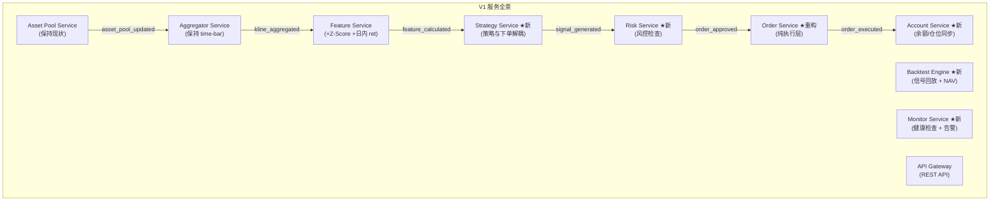
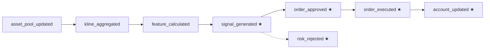
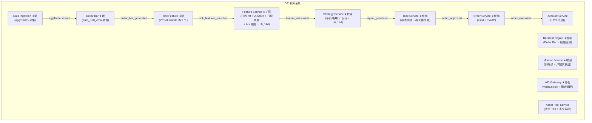
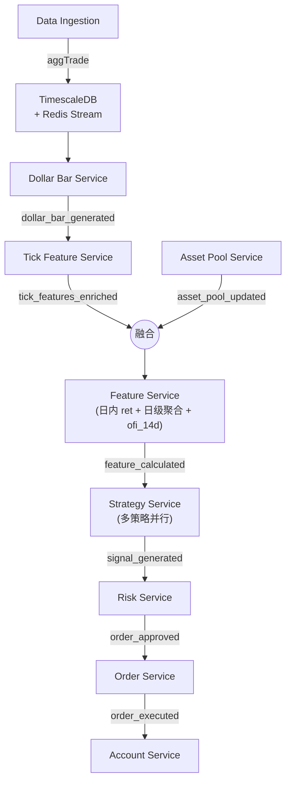
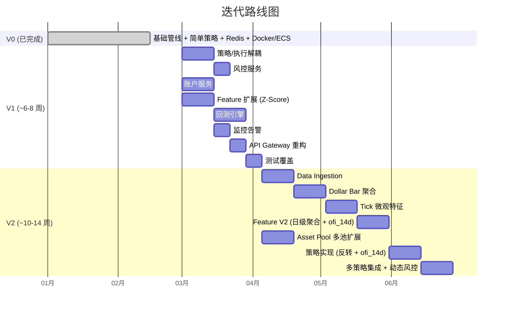
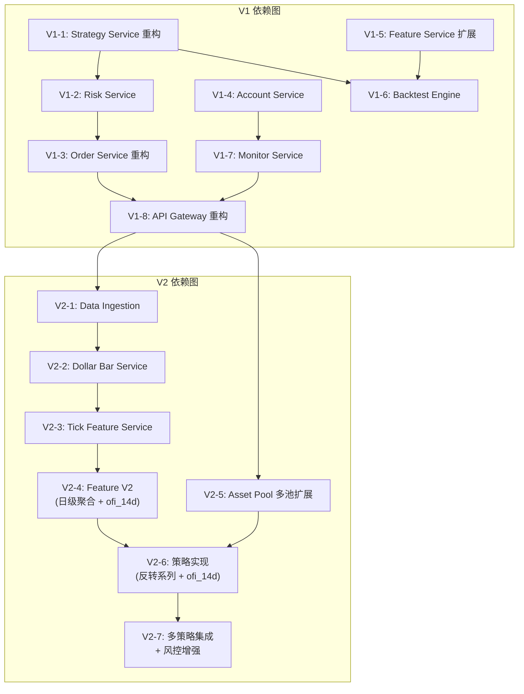

# 系统设计方案 — V1 / V2 迭代规划

> 编写时间: 2026-03-03
> 基于: 00_overview.md 策略研究成果 + 现有代码架构 Review + strategy_3.md (ofi_14d)

---

## 现状分析 (V0 — 当前已实现)

### 已完成

| 模块 | 实现状态 | 说明 |
|------|---------|------|
| Asset Pool Service | ✅ 完成 | 按 30 日 USDT 成交额筛选 Top-100 合约, 周期性更新 |
| Aggregator Service | ✅ 完成 | CCXT Pro WebSocket 接入, time-bar 聚合 (1m OHLCV), cross-section 触发 |
| Feature Service | ✅ 完成 | SMA / EMA / Volatility / Momentum / Volume Ratio, lookback = 7/14/30 |
| Futures Order Service | ✅ 完成 | 简单动量反转策略, 5L5S, 周度换仓, market order |
| Redis 事件总线 | ✅ 完成 | BaseEventService 抽象, Pub/Sub 四阶段链路 |
| 基础设施 | ✅ 完成 | Docker Compose / AWS ECS Fargate / GitHub Actions CI/CD |

### 核心差距 (V0 vs 目标系统)

| 维度 | V0 现状 | 目标 (00_overview) |
|------|---------|-------------------|
| Bar 类型 | Time Bar (1m) | **Dollar Bar** (自适应阈值 auto_K50_ema) |
| 特征体系 | 基础技术指标 (6 个) | **Tick 微观结构** (VPIN, Kyle's Lambda 等 9 个) + 日内特征 (1h/2h/4h/8h ret) |
| 信号构造 | 单因子 momentum | **多因子复合** (reversal × VPIN, regime switch 等 10 套) |
| 标准化 | 无 | **Z-Score** (30 日 rolling, shift(1) 防未来泄漏) |
| 回测 | 无 | **完整回测引擎** (IS/OOS, turnover fee, NAV 曲线) |
| 风控 | 无 | 需要仓位控制 / 止损 / 最大回撤限制 |
| 账户管理 | 无 (CLI stub) | 实时余额 / 仓位 / 挂单监控 |
| 监控告警 | 无 | 需要服务健康检查 / 异常告警 |

---

## V1 — 基础完善 + 回测闭环

### 目标

> **让系统从"能跑"升级为"可验证、可监控、可安全运行"的量化交易平台。**
> 核心交付: 回测引擎 + 风控层 + 账户服务 + 监控, 策略仍使用简化版本。

### V1 微服务拆分



### V1 各模块概要

> 各服务的详细设计（接口、事件流、配置模板等）参见 `docs/architecture.md`。
> 以下仅列出 V1 阶段每个模块的核心变更点。

| 模块 | 变更类型 | V1 核心变更 |
|------|---------|------------|
| Strategy Service | 新增 | 从 `FuturesOrderService` 抽离策略逻辑，引入 `BaseStrategy` 抽象；V1 内置 `BaselineRevStrategy` |
| Risk Service | 新增 | 风控前置检查：`signal_generated → order_approved / risk_rejected` |
| Order Service | 重构 | 移除策略逻辑，仅保留差量下单 + 重试 + dry-run |
| Account Service | 新增 | 统一调用交易所 API (30s 轮询)，缓存到 Redis |
| Feature Service | 扩展 | 新增日内 ret (1h/2h/4h/8h) + Z-Score 标准化 (shift(1)) |
| Backtest Engine | 新增 | 离线回测，与实盘共用 `BaseStrategy` 代码 |
| Monitor Service | 新增 | 心跳检查 + 数据延迟 / 异常仓位 / 资金变动告警 |

#### 8. API Gateway (重构)

**V1 暴露的 REST API:**


```
GET  /api/v1/health                   — 全局健康状态
GET  /api/v1/account/balance          — 账户余额
GET  /api/v1/account/positions        — 当前持仓
```

### V1 Redis 事件流 (完整)



### V1 配置文件新增

```
configs/
├── strategy_config.yaml       ★ 策略选择 + 参数
├── risk_config.yaml           ★ 风控规则
├── account_config.yaml        ★ 账户轮询间隔
├── monitor_config.yaml        ★ 告警阈值 + 渠道
├── backtest_config.yaml       ★ 回测参数
├── order_config.yaml          (重构: 移除策略参数, 保留执行参数)
├── asset_pool_config.yaml     (保持)
├── aggregator_config.yaml     (保持)
├── feature_config.yaml        (扩展: 新增 z-score 配置)
├── exchange_config.yaml       (保持)
└── db_config.yaml             (保持)
```

### V1 注意要点

1. **策略与执行解耦是最高优先级** — 现有 `FuturesOrderService` 将策略逻辑和下单逻辑混在一起, 无法独立测试策略, 也无法复用到回测。拆分后策略代码可同时用于实盘和回测。

2. **回测与实盘共用策略代码** — `BaseStrategy.generate_signal()` 的输入输出必须完全一致。回测引擎模拟 Feature Service 的输出格式, 策略无需感知自己在回测还是实盘。

3. **Risk Service 必须在 Order Service 之前** — 任何下单请求必须经过风控审批。这是资金安全的底线。

4. **Account Service 避免 API 调用竞争** — 统一由 Account Service 调用交易所 API, 其他服务从 Redis 读取。避免多个服务同时调用交易所 API 导致限频。

5. **Z-Score shift(1) 防泄漏** — Feature Service 中计算 Z-Score 时, rolling mean/std 必须 `shift(1)`, 即只用截至前一根 bar 的数据。这在回测中尤为关键。

6. **渐进迁移** — V1 不替换聚合方式 (仍用 time-bar), 不引入 tick 微观特征。先用现有数据管线验证回测闭环和风控的正确性。

7. **测试覆盖** — 策略 `generate_signal` 必须有单测; 风控规则必须有单测; 回测引擎必须与手动计算结果比对。

---

## V2 — Dollar Bar + Tick 微观特征 + 高级策略

### 目标

> **实现 00_overview.md 中描述的完整数据管线和策略体系, 达到研究阶段验证过的回测效果。**
> 核心交付: Dollar Bar 聚合 + Tick 微观特征 + Top 10 策略上线 + 多策略并行。

### V2 微服务拆分



### V2 各模块概要

> 各服务的详细设计（接口、配置、代码示例等）参见 `docs/architecture.md`。
> 策略信号公式详见 `docs/overview/strategy_1.md`、`docs/overview/strategy_2.md` 和 `docs/overview/strategy_3.md`。
> 以下仅列出 V2 阶段的增量变更。

| 模块 | 变更类型 | V2 核心变更 |
|------|---------|------------|
| Data Ingestion Service | 新增 | aggTrade 采集 → TimescaleDB + Redis Stream |
| Dollar Bar Service | 新增 | 自适应阈值 (auto_K50_ema) dollar bar，输出 23 列 |
| Tick Feature Service | 新增 | 9 个微观特征 (VPIN / Kyle's Lambda 等)，rolling 50 bars |
| Feature Service | 扩展 | 接入 `tick_features_enriched`，融合 tick + 传统特征；新增日级聚合层 (ofi_d, dollar_volume_d) + 多日滚动特征 (ofi_14d) |
| Asset Pool Service | 扩展 | 支持多种 pool profile: default Top-100 + 月度 T50 流动性池 (strategy_3 依赖) |
| Strategy Service | 扩展 | 10 套反转/tick 策略 + ofi_14d 动量策略上线；ensemble 多策略并行；灵活换仓周期 (R1/R14) |
| Risk Service | 增强 | 波动率自适应仓位、策略相关性检查、动态止损 |
| Order Service | 增强 | Limit Order + TWAP 拆单 + 智能路由 |
| Backtest Engine | 增强 | Dollar Bar 回测 + 策略组合回测 |

### V2 数据流 (完整)



### V2 注意要点

1. **数据量级飞跃** — aggTrade 数据量比 kline 大 2-3 个数量级。TimescaleDB 必须启用压缩和分区策略, Redis Stream 必须限制长度。考虑引入 Kafka 替代 Redis Stream 处理高吞吐场景。

2. **Dollar Bar 自适应阈值的冷启动** — 系统启动时没有历史 bar, 无法计算 EMA 阈值。解决方案: 预加载最近 N 天的 aggTrade 数据, 先离线生成种子 bar 确定初始阈值。

3. **Tick Feature 计算开销** — VPIN、Kyle's Lambda 等需要逐笔 tick 数据, rolling 50 bars window 可能涉及数万条 tick。需要:
   - 增量计算 (滑动窗口, 不重复扫描)
   - 考虑用 NumPy/Polars 向量化, 避免 Python 循环

4. **多策略权重调优** — V2 支持多策略并行, 但策略权重 (ensemble weight) 需要定期根据近期表现调整。初期可用固定权重, 后续考虑引入在线学习 (如 EWA)。

5. **回测与实盘的 Dollar Bar 一致性** — 离线回测的 Dollar Bar (从 Parquet 批量计算) 和实盘 (从 WebSocket 逐笔喂入) 必须产出完全一致的结果。需要端到端对比测试。

6. **Redis → Kafka 迁移的时机** — 如果 488 symbols 全量接入 aggTrade, Redis Pub/Sub 可能成为瓶颈。V2 可考虑:
   - 高频数据链路 (aggTrade → Dollar Bar): 用 Kafka / Redis Stream
   - 低频事件链路 (feature_calculated → signal 等): 保持 Redis Pub/Sub

7. **渐进上线** — V2 策略应先在回测中验证 OOS 表现, 再切入 paper trading (dry-run), 最后才投入实盘。建议同时运行 V1 策略 (momentum_reversal) 和 V2 策略, 对比实盘效果。

---

## 迭代路线图



### 依赖关系



---

## 技术选型建议

| 决策点 | V1 推荐 | V2 推荐 | 理由 |
|--------|---------|---------|------|
| 消息总线 | Redis Pub/Sub | Redis Pub/Sub + Kafka (高频链路) | V1 数据量可控; V2 aggTrade 量级需要 Kafka |
| 时序数据库 | TimescaleDB | TimescaleDB | 已部署, 够用 |
| 回测框架 | 自研 (轻量) | 自研 (扩展) | 与实盘策略接口一致更重要, 不需要第三方框架 |
| 告警渠道 | Webhook (Telegram) | Webhook + Grafana 仪表盘 | V1 轻量; V2 需要可视化 |
| 配置管理 | YAML + Pydantic | 同上 | 现有方案够用 |
| 计算加速 | — | NumPy / Polars | Tick 特征计算需要向量化 |
